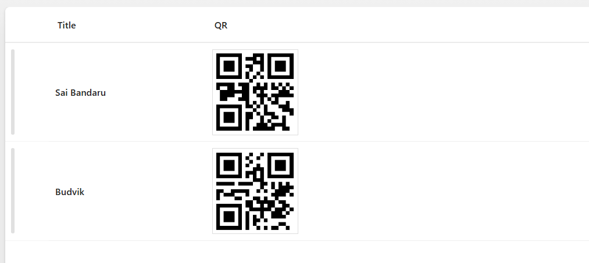

# QR Code Row Formatter

This sample uses **SharePoint List Formatting** to automatically generate QR codes for each list item based on the Title field.  
Each row displays the item title alongside a dynamically generated QR code, making it easy to create scannable links or references for physical handouts, inventory tracking, or event management.




## View Requirements

Create a list with the following columns:

| Internal Name   | Type               |
|-----------------|--------------------|
| **Title**       | Single line of text|
| **QR**          | Single line of text|

*Note: Additional columns can be added as needed for your specific use case.*

## Sample Data

| Title                    |
|--------------------------|
| Sai Bandaru              |
| Budvik                   |

## Summary

- The formatter displays each list item's **Title** with a corresponding **QR code**
- QR codes are generated dynamically using the [QRServer.com API](https://goqr.me/api/)
- Each QR code contains the exact text from the **Title** field
- The layout uses a clean horizontal design with proper spacing and alignment
- QR codes are displayed at 100x100 pixels with a white background and border

## Security Configuration

**CRITICAL**: Before the QR codes will display, you must configure SharePoint security settings:

1. Navigate to **SharePoint Admin Center**
2. Go to **Settings** > **Advanced Settings**  
3. Find **"HTML Field Security"** section
4. Add `api.qrserver.com` to the **allowed domains** list
5. Save the configuration

**Without this security configuration, QR codes will not display due to SharePoint's content security policies.**

## Sample

Solution|Author(s)
--------|---------
qr-code.json | [Sai Bandaru](https://github.com/saiiiiiii)

## Version history

Version|Date|Comments
-------|----|--------
1.0|August 29, 2025|Initial release

## Disclaimer
**THIS CODE IS PROVIDED *AS IS* WITHOUT WARRANTY OF ANY KIND, EITHER EXPRESS OR IMPLIED, INCLUDING ANY IMPLIED WARRANTIES OF FITNESS FOR A PARTICULAR PURPOSE, MERCHANTABILITY, OR NON-INFRINGEMENT.**

---

## Additional Notes

### Customization Options

**Change QR Code Size:**
Modify the API URL and CSS dimensions in the JSON:
```json
"src": "='https://api.qrserver.com/v1/create-qr-code/?size=200x200&data=' + [$Title]",
"width": "120px",
"height": "120px"
```

**Use Different Data Source:**
Replace `[$Title]` with any other text field:
```json
"src": "='https://api.qrserver.com/v1/create-qr-code/?size=150x150&data=' + [$Description]"
```

**Styling Modifications:**
- Adjust spacing: Change `"gap": "50px"` value
- Modify title width: Update `"min-width": "150px"`
- Customize borders and padding as needed

### Use Cases
- **Asset Management**: Generate QR codes for equipment or inventory items
- **Event Planning**: Create scannable codes for session titles or locations  
- **Document Tracking**: Link physical documents to digital versions
- **Contact Information**: Generate codes for email addresses or phone numbers
- **URL Shortening**: Create QR codes for long URLs or SharePoint page links

### Limitations
- Requires internet connectivity for QR code generation
- External dependency on QRServer.com API
- Consider data privacy when using external QR code services
- Performance may vary with large lists due to multiple API calls

## License
This formatting solution is provided as-is for educational and professional use. The QRServer.com API has its own terms of service.

