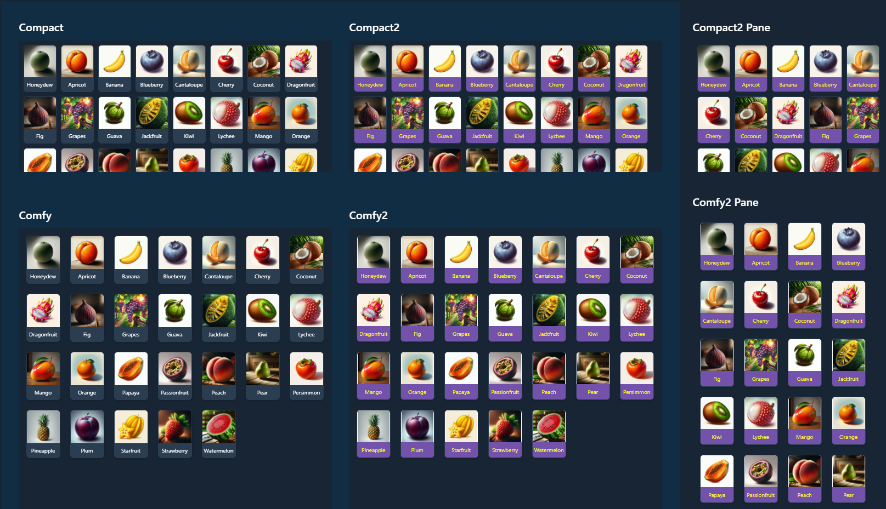
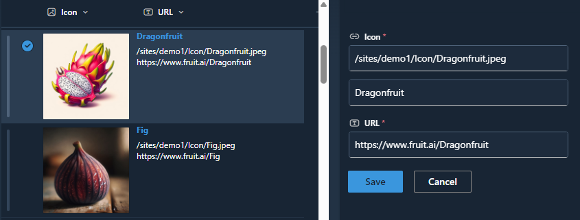

# Quick Links

## Summary
This sample shows custom quick links for adding to vertical section in a SharePoint page.

## View requirements
*View items with gallery previews

Field Name | Required | Type
---------- | -------- | ----
Title | Yes | Single line of text
Icon | Yes | Hyperlink or Picture (Picture)

## Sample

Solution|Author(s)
--------|---------
[comfy.json](./assets/comfy.json) | [Watana](https://github.com/Watana2)
[compact.json](./assets/compact.json) | [Watana](https://github.com/Watana2)
[compact2.json](./assets/compact2.json) | [Watana](https://github.com/Watana2)
[title-format.json](./assets/title-format.json) | [Watana](https://github.com/Watana2)

## Version history

Version|Date|Comments
-------|----|--------
1.0|August 2024|Initial release

## Disclaimer

**THIS CODE IS PROVIDED *AS IS* WITHOUT WARRANTY OF ANY KIND, EITHER EXPRESS OR IMPLIED, INCLUDING ANY IMPLIED WARRANTIES OF FITNESS FOR A PARTICULAR PURPOSE, MERCHANTABILITY, OR NON-INFRINGEMENT.**

---
