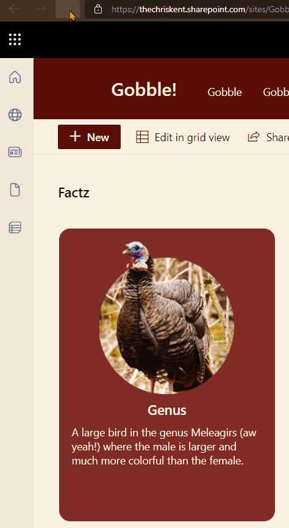
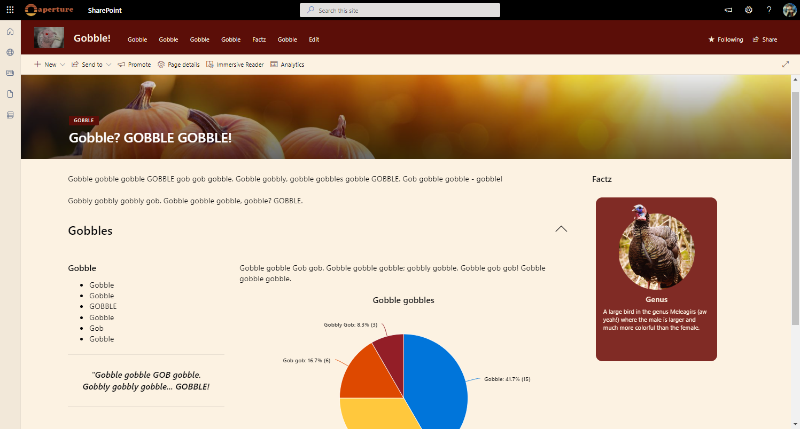

# Random Item

## Summary
This sample demonstrates utilizing layering to draw all rows on top of each other and then the z-index is set to a randomized value to determine which row to draw on the very top.

The trick is that the z-index is set using the `@now` parameter with a modulo operator against the total number of items (7). This number should be updated to match the number of items in the list you are trying to display. However, it can also be dynamic by setting this to a relatively high number.

In the above use case, this format has been used to display a random turkey fact! This can easily be added to a page using the list web part and will act as a miniature application.

## View requirements

|Type|Internal Name|Required|
|---|---|:---:|
|Single line of text|Title|Yes|
|Multiple line of text|Details|Yes|
|Image|Image|Yes

## Sample

Solution|Author(s)
--------|---------
random-item.json | [Chris Kent](https://github.com/thechriskent) ([@thechriskent](https://twitter.com/thechriskent))

## Version history

Version|Date|Comments
-------|----|--------
1.0|April 15, 2022|Initial release

## Disclaimer
**THIS CODE IS PROVIDED *AS IS* WITHOUT WARRANTY OF ANY KIND, EITHER EXPRESS OR IMPLIED, INCLUDING ANY IMPLIED WARRANTIES OF FITNESS FOR A PARTICULAR PURPOSE, MERCHANTABILITY, OR NON-INFRINGEMENT.**

---

