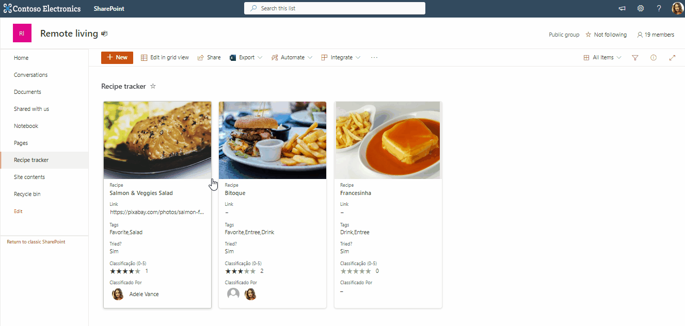
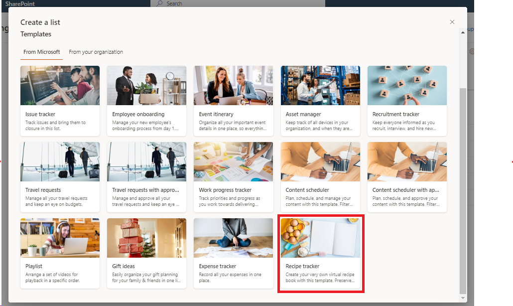
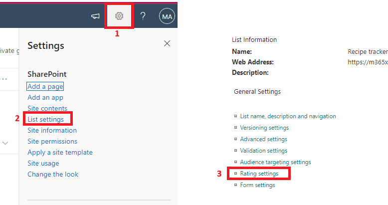
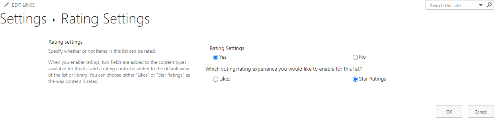
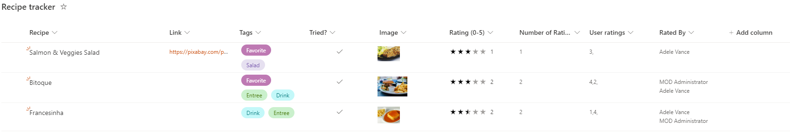

# Rating in Tiles

## Summary

This sample demonstrates how to create a clickable rating experience in the view Tile mode. It allows users to rate the item/document when in the tile mode. 



## View requirements

### Create a list using the template Recipe Tracker


### Add a ratings feature to the list
1. Click **gear icon**
2. Click **List Settings**
3. Under **General Settings**, click **Rating Settings**.

   

4. Under **Rating Settings**, click **Yes**.
5. Under **Which voting/rating experience you would like to enable for this list?**, click **Rating**.
6. Click **OK**.

   

### Adding rating fields to the default view
The following is an example of how to add the rating related fields to the default view using [PnP PowerShell](https://pnp.github.io/powershell).

```
$targetURL = "https://<tenantname>.sharepoint.com/sites/<site name>"
$listName = "<list title>" # Recipe Tracker

Connect-PnPOnline -Url $targetURL -Interactive

$list = Get-PnPList -Identity $listName
$list.DefaultView.ViewFields.Add("RatingCount")
$list.DefaultView.ViewFields.Add("Ratings")
$list.DefaultView.ViewFields.Add("RatedBy")
$list.DefaultView.Update()
Invoke-PnPQuery
```
After this the default view should look like:
 


## Sample

Solution|Author(s)
--------|---------
rating-in-tiles.json | [Luís Ribeiro](https://github.com/luis-ribeiro) ([@Luis_Ribeiro_PT](https://twitter.com/Luis_Ribeiro_PT))

## Version history

Version|Date|Comments
-------|----|--------
1.0|October 22, 2023|Initial release

## Disclaimer

**THIS CODE IS PROVIDED *AS IS* WITHOUT WARRANTY OF ANY KIND, EITHER EXPRESS OR IMPLIED, INCLUDING ANY IMPLIED WARRANTIES OF FITNESS FOR A PARTICULAR PURPOSE, MERCHANTABILITY, OR NON-INFRINGEMENT.**

---

## Additional notes
None


