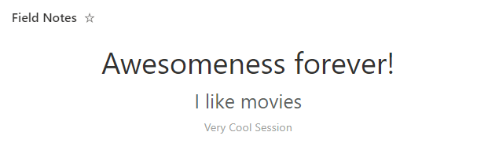

# Recent Comments

## Summary

This sample shows text from the most recent items by showing them in decresing sizes as they get older. This is very helpful for a quick summary view of a list and is great for adding directly to a page.

## View requirements

|Type|Internal Name|Required|
|---|---|:---:|
|Single line of text|Title|Yes|

The view itself is sorted by `Created` in descending order (Newest to Oldest) and has an Item Limit of 3.

## Sample

Solution|Author(s)
--------|---------
recent-comments.json | [Chris Kent](https://twitter.com/theChrisKent)

## Version history

Version|Date|Comments
-------|----|--------
1.0|April 4, 2022|Initial release

## Disclaimer

**THIS CODE IS PROVIDED *AS IS* WITHOUT WARRANTY OF ANY KIND, EITHER EXPRESS OR IMPLIED, INCLUDING ANY IMPLIED WARRANTIES OF FITNESS FOR A PARTICULAR PURPOSE, MERCHANTABILITY, OR NON-INFRINGEMENT.**

---

## Additional notes
None

