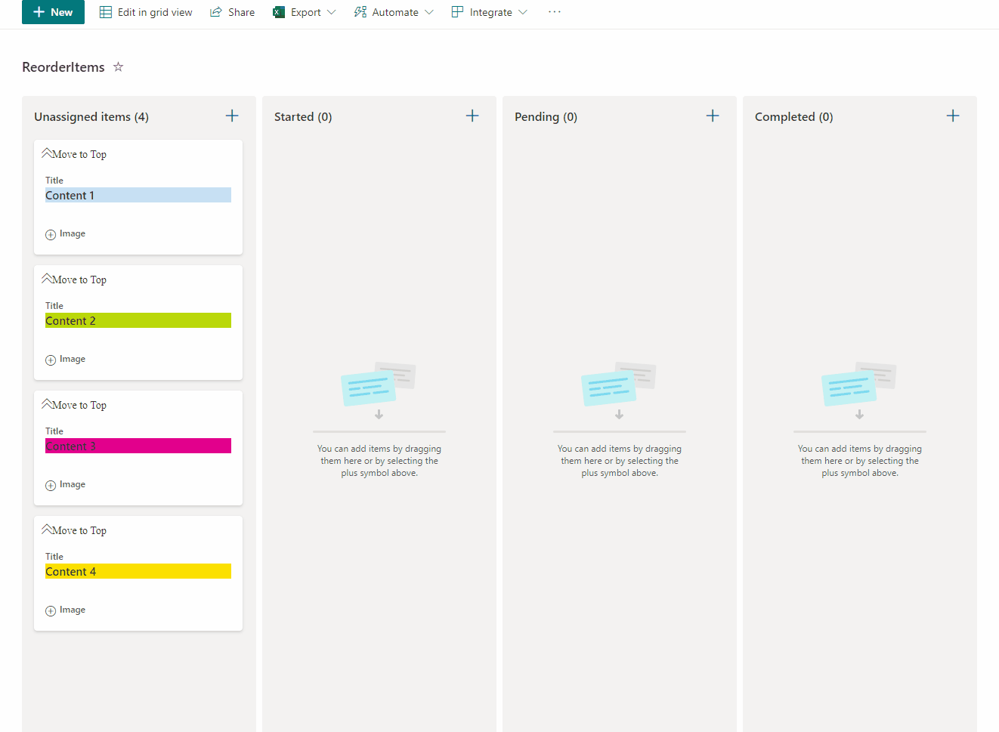

# Reorder and Expand Board Items

## Summary
This sample allow users to manage card order in Board Views and also enables expanding and collapsing images. This sample has the option "**Move to Top**" that allows users to move cards to the top of the board view as a way to rearrange card positions.

## View requirements
- The format expect the following fields:

Field |Type
--------|---------
Title | Single line of text 
Category | Choice - Include the following options **"Started,Pending,Completed"**
Order | Single line of text   - Manage the order of cards
Image | Single line of text   - This field allow to include url to image.
Expand | Yes/No - default value **"No"**

### Create Board View

- Access to View dropdown and select "**Create new view**"
- Add new Name and select option "**Board**"

### Edit List View requirements

- Access to List Settings > access to "**Views**" area and select created view.
- Edit View where format will be included:
   - Access to "**Sort**" Area and select column "**Order**" and check as **descending order**, this option order the cards based on changed.

## Sample

Solution|Author(s)
--------|---------
reorder-expand-board-items.json | [André Lage](https://github.com/aaclage)

## Version history

Version|Date|Comments
-------|----|--------
1.0|February 15, 2022|Initial release

## Disclaimer
**THIS CODE IS PROVIDED *AS IS* WITHOUT WARRANTY OF ANY KIND, EITHER EXPRESS OR IMPLIED, INCLUDING ANY IMPLIED WARRANTIES OF FITNESS FOR A PARTICULAR PURPOSE, MERCHANTABILITY, OR NON-INFRINGEMENT.**

