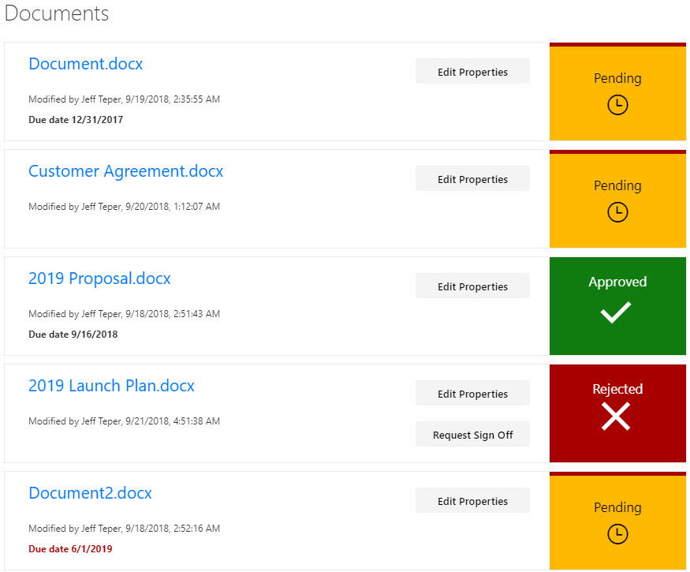
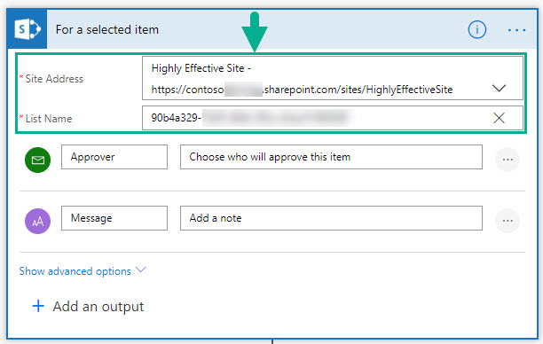

# Request Sign-Off

## Summary

This sample provides a custom view to focus on files within a document library that need to be approved. A Power Automate flow is included to request sign-off (and to launch that flow directly from the view). This format provides a better visual indication of where documents are in the approval process.



## View requirements

The view must include these columns:

### Standard columns

- LinkFilename
- Editor
- Modified

### Custom columns

Column Name|Type
-----------|----
RequiresSignOff | Boolean
SignOffDueDate | DateTime
SignOffStatus | Text

### Provisioning

This sample includes a site script ([update-documents.json](./provisioning/update-documents.json)) that creates the required site columns, the Document Library, and a new view named **All Documents - customized** in the Document Library that contains all the required columns.

See the [SharePoint site design and site script overview article](https://docs.microsoft.com/en-us/sharepoint/dev/declarative-customization/site-design-overview) to learn how to use the site script.

## Flow Integration

### Install the Flow

1.	**Import** the Flow ([requestsignoff.zip](./provisioning/requestsignoff.zip)), which is basically the same Flow as the out of the box Request Sign Off Flow, but its ID is knowable and it can be modified.
2.	**Rename** the Flow.
3.  Find all the places where the Flow refers to the original site and Document Library, and change it to the site / Document Library in your environment.

  > **Note:** Be sure to use the Document Library GUID, not the name.

  

  You will make these updates in 5 places:

    For a selected item node
    Get item node
    Update item node Update Sign Off Status: Pending
    Update item node Update Sign Off Status: Approved
    Update item node Update Sign Off Status: Rejected

4. **Save** the Flow.
5. Copy the **Flow ID**.

### Update the Flow ID in the View Formatter JSON

The View Formatter JSON ([request-signoff.json](request-signoff.json)) defines a button labeled Request Sign Off that executes a Flow.  To make it execute the Flow you just imported, follow these steps.

1. Replace the **actionParams id value** (shown below) with the ID of the Flow you imported and configured in the steps above.

````json
                "elmType": "button",
                "customRowAction": {
                  "action": "executeFlow",
                  "actionParams": "{\"id\": \"3fee4531-d1c5-4e3d-9e4a-8bdecd81257b\"}"
                },
                "txtContent": "Request Sign Off",
                "attributes": {
                  "class": "sp-row-button"
                },
````

## Sample

Solution|Author(s)
--------|---------
request-sign-off.json | [Lincoln DeMaris](https://github.com/ldemaris), [Todd Baginski](https://github.com/TBag), Justin So, Tyler Lui

## Version history

Version|Date|Comments
-------|----|--------
1.0|October 9, 2018|Initial release

## Disclaimer

**THIS CODE IS PROVIDED *AS IS* WITHOUT WARRANTY OF ANY KIND, EITHER EXPRESS OR IMPLIED, INCLUDING ANY IMPLIED WARRANTIES OF FITNESS FOR A PARTICULAR PURPOSE, MERCHANTABILITY, OR NON-INFRINGEMENT.**

---

## Additional notes
None


