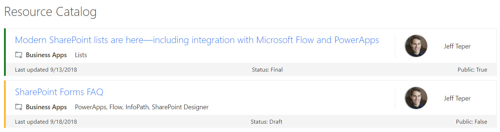

# Resource Catalog

## Summary

SharePoint lists are excellent places to store information. This example demonstrates how to use a custom SharePoint list to implement a marketing resources catalog. This sample defines a custom view to bring focus to the status of items in the resource catalog. It also provides a better visual experience by displaying all the data in an easy to read format by using icons, colors, and profile pictures.

## View requirements

The view must include these columns:

### Standard columns

- LinkTitle
- Modified

### Custom columns

Column Name|Type
-----------|----
ResourcePillar | Text
ResourceTechnology | Text
ResourceStatus | Text
ResourcePublic | Boolean
ResourceOwner | User

## Site Script

This sample includes a site script ([create-list.json](./provisioning/create-list.json)) that creates the required site columns, the Resource Catalog list, and a new view named **All Items - customized** in the list that contains all the required columns.

See the [SharePoint site design and site script overview article](https://docs.microsoft.com/en-us/sharepoint/dev/declarative-customization/site-design-overview) to learn how to use the site script.

## Sample

Solution|Author(s)
--------|---------
resource-catalog.json | [Todd Baginski](https://github.com/TBag), [Lincoln DeMaris](https://github.com/ldemaris), Chris McNulty, Tyler Lui, Justin So

## Version history

Version|Date|Comments
-------|----|--------
1.0|October 9, 2018|Initial release

## Disclaimer

**THIS CODE IS PROVIDED *AS IS* WITHOUT WARRANTY OF ANY KIND, EITHER EXPRESS OR IMPLIED, INCLUDING ANY IMPLIED WARRANTIES OF FITNESS FOR A PARTICULAR PURPOSE, MERCHANTABILITY, OR NON-INFRINGEMENT.**

---

## Additional notes
None

