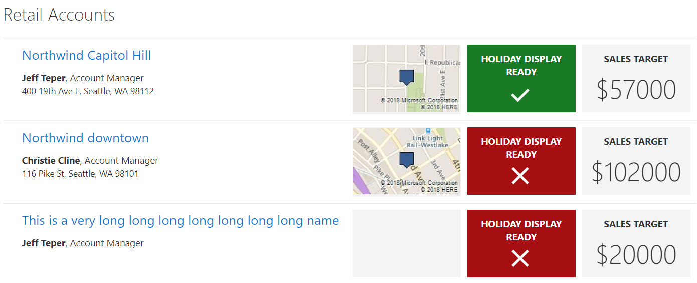

# Retail Accounts

## Summary

SharePoint lists are excellent places to store information. This example demonstrates how to use a custom SharePoint list to manage retail stores. This sample defines a custom view to bring focus to the status of store locations. It also provides a better visual experience by displaying all the data in an easy to read format by using icons, colors, and Bing maps.



## View requirements

The view must include these columns:

### Standard columns

- LinkTitle
- Location

### Custom columns

Column Name|Type
-----------|----
Account_x0020_Manager | User
Sales_x0020_Target | Currency
Holiday_x0020_Display_x0020_Read | Boolean

## Site Script

This sample includes a site script ([create-list.json](create-list.json)) that creates the required site columns, the Retail Accounts list, and a new view named **All Items - customized** in the list that contains all the required columns.

See the [SharePoint site design and site script overview article](https://docs.microsoft.com/en-us/sharepoint/dev/declarative-customization/site-design-overview) to learn how to use the site script.

## Bing Map

The View Formatter JSON ([card-format.json](card-format.json)) uses the Bing Map Imagery REST API to display map images based on the values in the Location column.  

  > **Note:** You will need your own Bing Maps key to display the maps in your own environment.

1. First, get a Bing Maps Key. 
    
    [https://msdn.microsoft.com/en-us/library/ff428642.aspx](https://msdn.microsoft.com/en-us/library/ff428642.aspx)

2. Then, replace the **key querystring parameter value** (the YOUR BING MAP API KEY placeholder shown in the code below) with your own Bing Maps key.

````json
"elmType": "img",
"attributes": {
  "class": " ms-borderColor-neutralLighter",
  "src": "='https://dev.virtualearth.net/REST/v1/Imagery/Map/Road?mapSize=171,106&pp=' + if([$Location.Coordinates.Latitude], [$Location.Coordinates.Latitude], '0') + ',' + if([$Location.Coordinates.Longitude], [$Location.Coordinates.Longitude], '0') + '&key=YOUR BING MAP API KEY'"
````

## Sample

Solution|Author(s)
--------|---------
retail-accounts.json | [Todd Baginski](https://github.com/TBag), [Lincoln DeMaris](https://github.com/ldemaris), Chris McNulty, Tyler Lui, Justin So

## Version history

Version|Date|Comments
-------|----|--------
1.0|October 9, 2018|Initial release

## Disclaimer

**THIS CODE IS PROVIDED *AS IS* WITHOUT WARRANTY OF ANY KIND, EITHER EXPRESS OR IMPLIED, INCLUDING ANY IMPLIED WARRANTIES OF FITNESS FOR A PARTICULAR PURPOSE, MERCHANTABILITY, OR NON-INFRINGEMENT.**

---

## Additional notes
None


