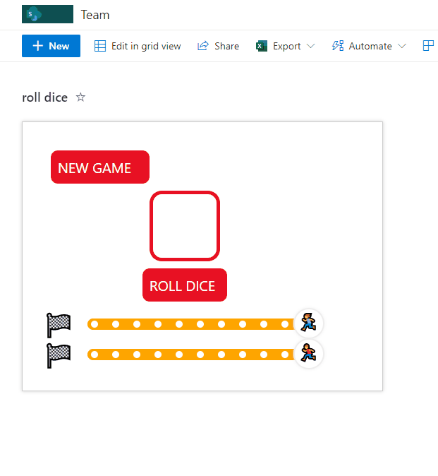

# Roll Dice

## Summary
This sample format provides a simulation of a game where a random number (between 1 and 6) is generated and displayed as a die. The value makes the progress bar advance with the associated emoji until the value 0 is reached and the winner emoji appears.

## View requirements
- The format expects the following fields:

Field |Type
--------|---------
Title | Single line of text 
Value | Number
Value2 | Number
Dice | Number
Dice2 | Number
Position | Single line of text 
Character1 | Single line of text - Include emoji of runner "🏃‍♀️"
Character2 | Single line of text - Include emoji of runner "🏃"

## Sample

Solution|Author(s)
--------|---------
roll-dice.json | [André Lage](https://github.com/aaclage) ([@aaclage](https://twitter.com/aaclage))

## Version history

Version|Date|Comments
-------|----|--------
1.0|January 21, 2022|Initial release

## Disclaimer
**THIS CODE IS PROVIDED *AS IS* WITHOUT WARRANTY OF ANY KIND, EITHER EXPRESS OR IMPLIED, INCLUDING ANY IMPLIED WARRANTIES OF FITNESS FOR A PARTICULAR PURPOSE, MERCHANTABILITY, OR NON-INFRINGEMENT.**

