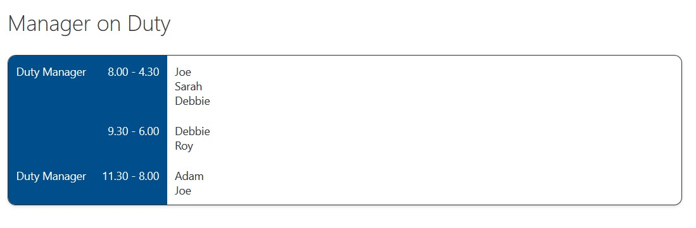

# Staff Rota Shifts with CSS Table

## Summary
This sample demonstrates creating a Rota Shifts table using CSS Table layout by using `rowFormatter` to customise the entire display of a row. The aim is to demonstrate the following concepts:
- using a CSS table layout (`"display": "table"`, `"display": "table-row"`, `"display": "table-cell"`)
- using Fluent UI classes for font sizing, font color and background color
  - specifically the theme color class to ensure display matches the theme of the site (`ms-bgColor-themePrimary`)
- disabling selection (`hideSelection`)
- hiding column headers (`hideColumnHeader`)
- using `join` and `\n` to join choice column values on separate lines

## View Requirements

Included in the sample is a site script that will create the list as needed. However if you prefer to create the list yourself here are the fields needed:

|Type|Internal Name|Required|
|---|---|:---:|
|Single line of text|Title|No|
|Multi-Choice|Shift1|No|
|Multi-Choice|Shift2|No|
|Multi-Choice|Shift3|No|
|Single line of text|Date|No|

## Sample

Solution|Author(s)
--------|---------
rota-css-table.json | [Ariel Kropp](https://github.com/arielkropp) ([@arielkropp](https://twitter.com/arielkropp))

## Version history

Version|Date|Comments
-------|----|--------
1.0|March 07, 2019|Initial release

## Disclaimer
**THIS CODE IS PROVIDED *AS IS* WITHOUT WARRANTY OF ANY KIND, EITHER EXPRESS OR IMPLIED, INCLUDING ANY IMPLIED WARRANTIES OF FITNESS FOR A PARTICULAR PURPOSE, MERCHANTABILITY, OR NON-INFRINGEMENT.**

