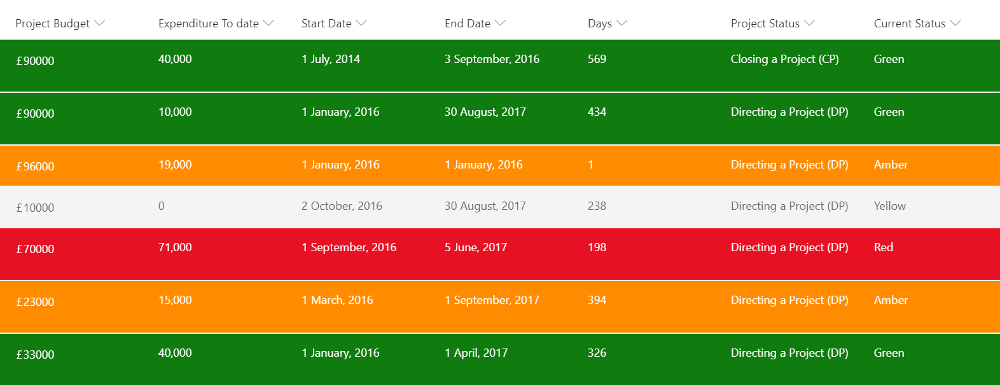

# RYG Status

## Summary

A status column is evaluated to provide colors corresponding to status. This format uses the values Red, Yellow, Green, and Amber but you could easily extend this to fit your own color-coded system by adding or removing nested conditions.

## View requirements
The format expects the following field:

Field |Type
--------|---------
Status | Single line of text / Choice

> To use a lookup column instead, replace all occurences of [$internalfieldname] with  [$internalfieldname.lookupValue].

## Sample

Solution|Author(s)
--------|---------
ryg-status-rowclass.json | [S Merchant](https://github.com/sohailmerchant) ([@sohailmerchant](https://twitter.com/sohailmerchant))

## Version history

Version|Date|Comments
-------|----|--------
1.0|Septmeber 9, 2018|Initial release

## Disclaimer
**THIS CODE IS PROVIDED *AS IS* WITHOUT WARRANTY OF ANY KIND, EITHER EXPRESS OR IMPLIED, INCLUDING ANY IMPLIED WARRANTIES OF FITNESS FOR A PARTICULAR PURPOSE, MERCHANTABILITY, OR NON-INFRINGEMENT.**

