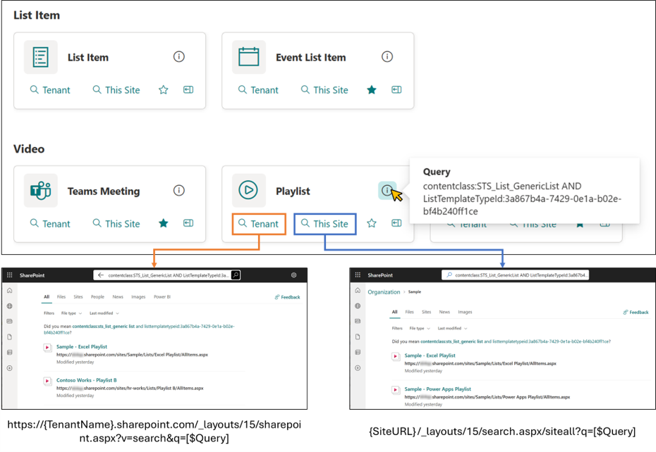
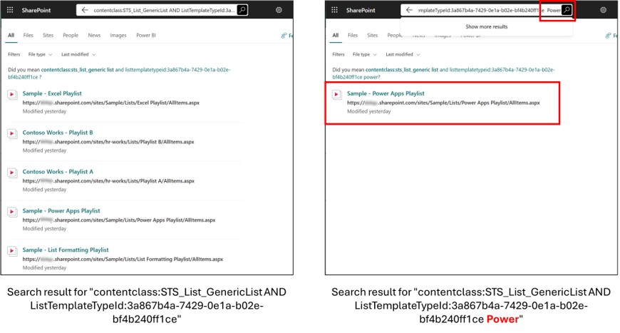
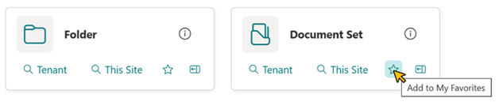
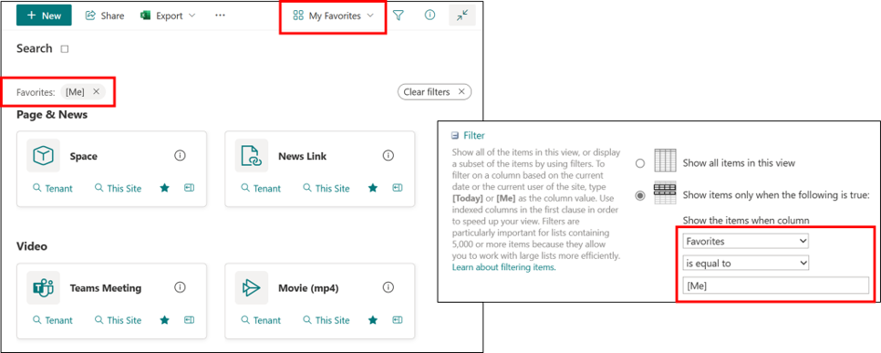
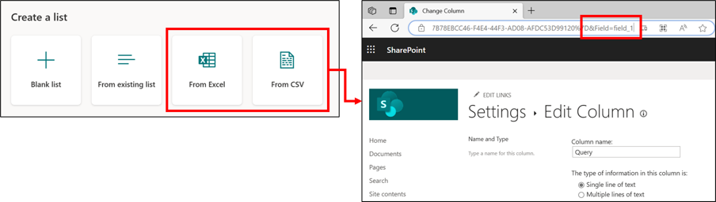

# Links to Search Page

## Summary

This sample demonstrates displaying links to the search page. When you open the search page, it displays the search results where the query registered in the `Query` column of the item has been executed. Also, there are two types of links, each with a different search scope. One is for the entire tenant, and the other is for within the site.

You can also add search keywords on the search page to further refine your search results.

In addition, there is a favorite feature using the `setValue` action.

In addition to a view that shows all items, it is useful to create a view that displays only the items you have added to your favorites.

## View requirements

|Type                         |Internal Name|Required|
|-----------------------------|-------------|:------:|
|Single line of text          |Title        |Yes     |
|Single line of text          |Query        |Yes     |
|Single line of text or Choice|Category     |Yes     |
|Single line of text          |Icon         |Yes     |
|Multi-Select Person          |Favorites    |        |

- Set the icon name of [Fluent UI Icons](https://developer.microsoft.com/fluentui#/styles/web/icons) in the `Icon` column.
- You need to use Gallery view grouped by `Category` column

### Sample Data

- You can view [sample data (CSV file)](./assets/sample-data.csv).
- When using the Excel import and CSV import functions, the internal names of the columns are "field_" + "sequential number" like field_1, field_2. And these internal names of columns are not used in the sample JSON. Therefore, please note that the sample JSON cannot be used as it is when using the Excel import and CSV import functions.
    
- As of August 15, 2023, the gallery view is not available when [exporting from Excel to SharePoint](https://support.microsoft.com/office/export-an-excel-table-to-sharepoint-974544f9-94bc-4aa8-9159-97282d256dab). Please note this as well.  
Related Link: [Export an Excel table to SharePoint: gallery view layout not available · Issue #8811 · SharePoint/sp-dev-docs](https://github.com/SharePoint/sp-dev-docs/issues/8811)
- If you want to import the sample data into your list, I recommend downloading the CSV file of the sample data, opening it in Excel, copying a range of all the data, and pasting it in using Edit Grid View.

## Sample

Solution|Author(s)
--------|---------
search-page-link-tiles.json | [Tetsuya Kawahara](https://github.com/tecchan1107) ([@techan_k](https://twitter.com/techan_k))

## Version history

Version |Date            |Comments
--------|----------------|--------------------------------
1.0     |August 15, 2023 |Initial release

## Disclaimer
**THIS CODE IS PROVIDED *AS IS* WITHOUT WARRANTY OF ANY KIND, EITHER EXPRESS OR IMPLIED, INCLUDING ANY IMPLIED WARRANTIES OF FITNESS FOR A PARTICULAR PURPOSE, MERCHANTABILITY, OR NON-INFRINGEMENT.**

---

## Additional notes

- This sample was inspired by [Ai Hirano's post](https://twitter.com/ai_yamasaki/status/1545353487533232130).
- The following documents describe the managed property and the search query.
  - [Manage the search schema in SharePoint | Microsoft Learn](https://learn.microsoft.com/sharepoint/manage-search-schema)
  - [Keyword Query Language (KQL) syntax reference | Microsoft Learn](https://learn.microsoft.com/sharepoint/dev/general-development/keyword-query-language-kql-syntax-reference)
- [SharePoint Search Query Tool](https://github.com/pnp/PnP-Tools/tree/master/Solutions/SharePoint.Search.QueryTool) allows you to see what values are set for which managed properties, which is very helpful when building a query.
- Using [PnP Modern Serach](https://microsoft-search.github.io/pnp-modern-search/), you can place search-related web parts on the page.

