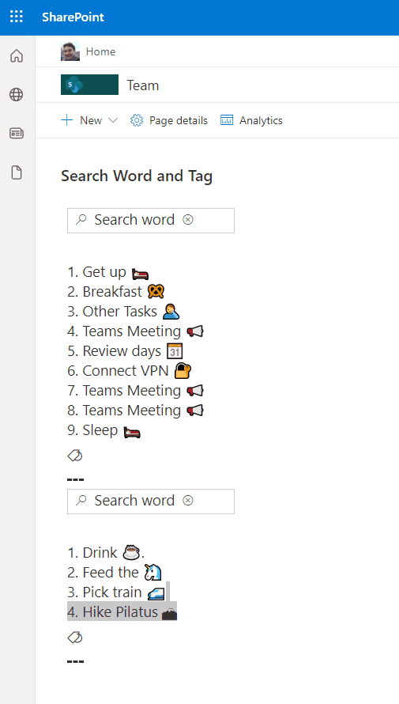

# Search Within Tag

## Summary
This sample demonstrates using `inlineEditField` to enable searching for a word against tags (choice column) within a list item.

## View requirements
- The format expect the following fields:

Field |Type
--------|---------
Title | Single line of text 
Description | Multiple line of text 
SearchText | Single line of text - Support field to search words in description field.
CustomTags | Choice ("Allow multiple selections" to yes and check "Can add values manually") - This field configuration allow to add multiple values.

## Sample

Solution|Author(s)
--------|---------
search-within-tags.json | [André Lage](https://github.com/aaclage) ([@aaclage](https://twitter.com/aaclage))

## Version history

Version|Date|Comments
-------|----|--------
1.0|December 12, 2021|Initial release

## Disclaimer
**THIS CODE IS PROVIDED *AS IS* WITHOUT WARRANTY OF ANY KIND, EITHER EXPRESS OR IMPLIED, INCLUDING ANY IMPLIED WARRANTIES OF FITNESS FOR A PARTICULAR PURPOSE, MERCHANTABILITY, OR NON-INFRINGEMENT.**

