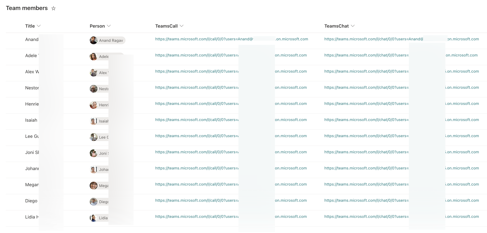
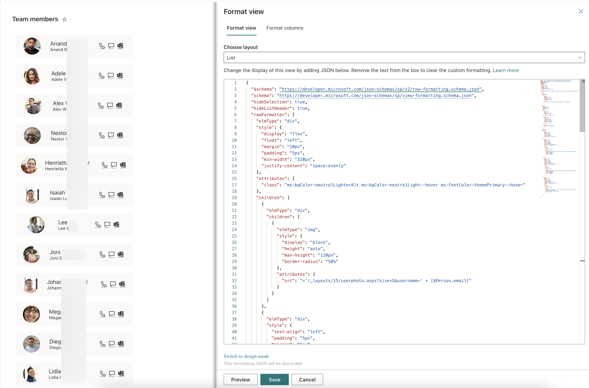

# Speed dial

## Summary
This sample creates a speed dial list for your team members/contacts, that you can list as a tab in your teams channel and/or display on your Team SharePoint site, to get quick access to your contacts through Teams call, chat and email.

## View requirements

|Type|Internal Name|Required|
|---|---|:---:|
|Single line of text|Title|Yes|
|Person or Group|Person|Yes|
|Hyperlink|TeamsCall|Yes|
|Hyperlink|TeamsChat|Yes|

## Sample

Solution|Author(s)
--------|---------
speed-dial.json | [Anand Ragav](https://github.com/anandragav)

## Version history

Version|Date|Comments
-------|----|--------
1.0|June 22, 2022|Initial release

## Disclaimer
**THIS CODE IS PROVIDED *AS IS* WITHOUT WARRANTY OF ANY KIND, EITHER EXPRESS OR IMPLIED, INCLUDING ANY IMPLIED WARRANTIES OF FITNESS FOR A PARTICULAR PURPOSE, MERCHANTABILITY, OR NON-INFRINGEMENT.**

---

## Additional notes
The hyperlinks in the teamscall and teamschat columns are deep links to Teams chat and teams calls respectively with a single user. Refer deep links documentation for Microsoft Teams. 

