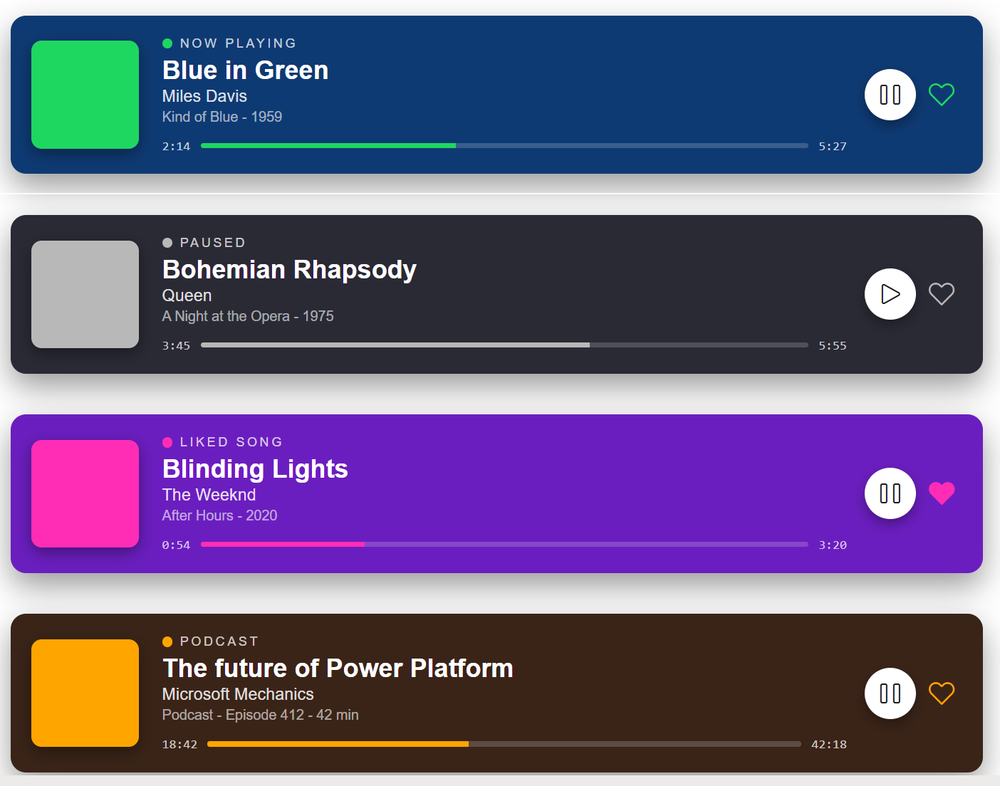

# Spotify Now Playing

## Summary

This SharePoint JSON view formatting sample transforms list items into Spotify-style "now playing" cards. Each item shows an album-art block, a status row with a coloured dot, the track title, artist, and album, a horizontal progress bar with elapsed and total time, and a play / like control row.

It's designed for music libraries, podcast catalogues, listening logs, or any "now playing" queue style list.

## View requirements

### Recommended SharePoint List Columns

| Column Name       | Internal Name     | Type                | Description                                                                       |
| ----------------- | ----------------- | ------------------- | --------------------------------------------------------------------------------- |
| Title             | Title             | Single line of text | Track or episode title                                                            |
| Artist            | Artist            | Single line of text | Artist or show host                                                               |
| Album             | Album             | Single line of text | Album name + year, or "Podcast - Episode N - duration" for podcasts               |
| Status            | Status            | Choice              | Now Playing, Paused, Liked Song, Podcast, Recently Played, Workout                |
| Background Color  | BackgroundColor   | Single line of text | Card background hex (e.g. `#1a1a2e`)                                              |
| Accent Color      | AccentColor       | Single line of text | Hex for the album-art block, status dot and progress fill (e.g. `#1ed760`)        |
| Elapsed Time      | ElapsedTime       | Single line of text | Time elapsed as `M:SS` (e.g. `2:14`)                                              |
| Duration Time     | DurationTime      | Single line of text | Total duration as `M:SS` (e.g. `5:27`)                                            |
| Progress Percent  | ProgressPercent   | Number              | Track progress 0 - 100 (drives the bar fill width)                                |
| Play Icon         | PlayIcon          | Single line of text | Fluent UI icon name for the play button: `Play` or `Pause`                        |
| Like Icon         | LikeIcon          | Single line of text | Fluent UI icon name for the heart: `Heart` (not liked) or `HeartFill` (liked)     |
| Track URL         | TrackUrl          | Single line of text | Streaming URL opened when the play button is clicked (e.g. `https://open.spotify.com/search/...`) |

A PowerShell script has been provided in the [assets](./assets/Create%20List.ps1) folder to provision the list for you. The script also seeds 6 sample tracks covering every Status value.

**Note:** This script uses [PnP PowerShell](https://pnp.github.io/powershell/) and requires an environment ready for PnP PowerShell.

## Sample

Solution|Author
--------|---------
spotify-now-playing.json | [Sudeep Ghatak](https://github.com/sudeepghatak) ([LinkedIn](https://www.linkedin.com/in/sudeepghatak/))

## Version history

Version|Date|Comments
-------|----|--------
1.0|May 12, 2026|Initial release

## Disclaimer

**THIS CODE IS PROVIDED *AS IS* WITHOUT WARRANTY OF ANY KIND, EITHER EXPRESS OR IMPLIED, INCLUDING ANY IMPLIED WARRANTIES OF FITNESS FOR A PARTICULAR PURPOSE, MERCHANTABILITY, OR NON-INFRINGEMENT.**

---

## Additional notes

- **Colours are column-driven, not conditional.** Both `BackgroundColor` and `AccentColor` are read directly from the list item via `[$BackgroundColor]` / `[$AccentColor]`. The provisioning script seeds sensible defaults per Status, but you can override per item without touching the formatter.
- **Icons are column-driven too.** The play button and the heart icon both use `iconName: "[$PlayIcon]"` and `iconName: "[$LikeIcon]"`. Pick from the Fluent UI v1 icon set — common values are `Play`, `Pause`, `Heart`, `HeartFill`.
- **Progress bar width** is computed with `=toString([$ProgressPercent]) + '%'`. Store a plain integer 0 - 100 in the `ProgressPercent` column and the bar fills proportionally.
- **Clicking the play button opens the track URL in a new tab** - the play element is rendered as an `<a>` with `href: "[$TrackUrl]"` and `target: "_blank"`. SharePoint view formatters cannot embed an audio player, so this is the practical way to "play" a track. The seeded sample tracks use `https://open.spotify.com/search/...` URLs which always resolve, but you can store any streaming URL (Spotify track, Apple Music, YouTube, internal podcast feed, etc).
- The album-art block is a solid coloured square overlaid with a Fluent `Headphones` icon - no images required.
- Time strings (`ElapsedTime`, `DurationTime`) are stored as plain text in `M:SS` format to keep the formatter simple. If you would rather store seconds, swap them for a calculated text column using the seconds-to-time conversion of your choice.

