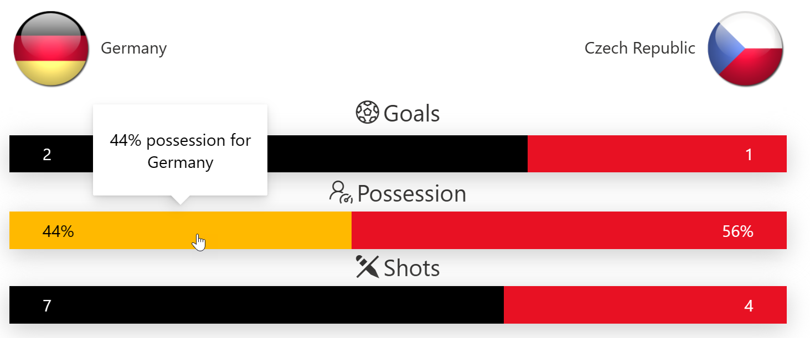

# Stat Comparison Chart

## Summary
These samples format a list view into a chart that shows a comparison between two entities against various attributes. This sample can be used for all sorts of things but is demonstrated below using sports teams for the entities and stats for the teams as individual rows.

There are 2 versions of the sample included. The difference being that one shows images to represent each entity (team country flags in this case) and icons for individual stats while the other does not.

**Version without Images:**

> These samples are dervied from the [Butterfly Chart Sample](../butterfly-chart/).

## View requirements (stat-comparison-chart.json)

|Type                |Internal Name|Required|Details|
|--------------------|-------------|:------:|-------|
|Single line of text |Title        |Yes     |The attribute against which the stats are measured|
|Single line of text |Icon         |No      |Icon to represent the attribute|
|Number              |Entity1      |Yes     |The stat value for the first entity|
|Number              |Entity2      |Yes     |The stat value for the second entity|
|Yes/No              |IsPercent    |No      |True when the stat is a percentage|
|Image               |Entity1Image |No      |Image to represent the first entity. Will be only displayed for the first row at the top left. |
|Image               |Entity2Image |No      |Image to represent the second entity. Will be only displayed for the first row at the top right.|

## View requirements (stat-comparison-chart-without-images.json)

These requirements are the same as above except that icons and images are not needed.

|Type                |Internal Name|Required|
|--------------------|-------------|:------:|
|Single line of text |Title        |Yes     |
|Number              |Entity1      |Yes     |
|Number              |Entity2      |Yes     |
|Yes/No              |IsPercent    |No      |

## Sample

Solution|Author(s)
--------|---------
stat-comparison-chart.json | [Anoop Tatti](https://github.com/anoopt)
stat-comparison-chart-without-images.json | [Anoop Tatti](https://github.com/anoopt)

## Version history

Version |Date              |Comments
--------|------------------|--------
1.0     |June 23, 2021  |Initial release

## Disclaimer
**THIS CODE IS PROVIDED *AS IS* WITHOUT WARRANTY OF ANY KIND, EITHER EXPRESS OR IMPLIED, INCLUDING ANY IMPLIED WARRANTIES OF FITNESS FOR A PARTICULAR PURPOSE, MERCHANTABILITY, OR NON-INFRINGEMENT.**

