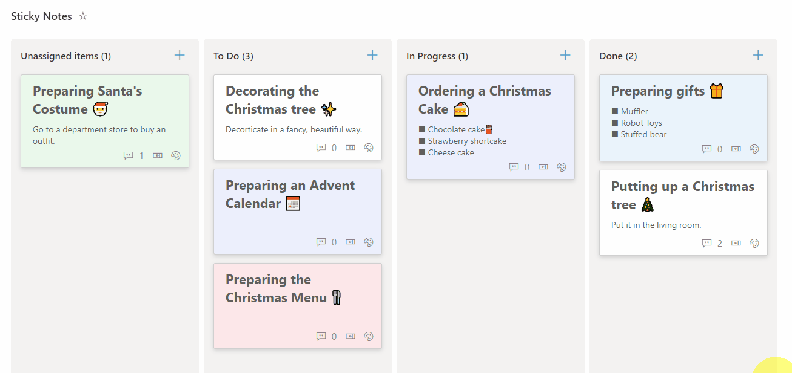

# Sticky Notes Board

## Summary
This sample demonstrates how to display sticky notes in Board View. The color of the stickies can be changed from the palette icon, and there are 6 different colors available.

## View requirements

|Type                  |Internal Name|Required|
|----------------------|-------------|:------:|
|Single line of text   |Title        |Yes     |
|Multiple lines of text|Description  |        |
|Single line of text   |Color        |        |

- You need to use the Board View.

## Sample

Solution|Author(s)
--------|---------
sticky-notes-board.json | [Tetsuya Kawahara](https://github.com/tecchan1107) ([@techan_k](https://twitter.com/techan_k))

## Version history

Version |Date             |Comments
--------|-----------------|--------------------------------
1.0     |February 8, 2022 |Initial release

## Disclaimer
**THIS CODE IS PROVIDED *AS IS* WITHOUT WARRANTY OF ANY KIND, EITHER EXPRESS OR IMPLIED, INCLUDING ANY IMPLIED WARRANTIES OF FITNESS FOR A PARTICULAR PURPOSE, MERCHANTABILITY, OR NON-INFRINGEMENT.**

