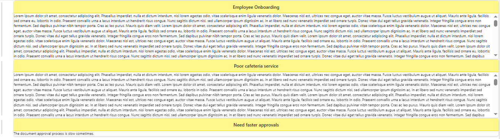

# Sticky Title Feedback Card

This sample uses **SharePoint List Formatting** to display feedback items as **card-style layouts** with a prominent title header and scrollable feedback content.  
Each row is rendered as a visually appealing card with a yellow header for the title and a scrollable area for longer feedback text.

## View Requirements

Create a list with the following columns:

| Internal Name   | Type               |
|-----------------|--------------------|
| **Title**       | Single line of text|
| **Feedback**    | Multiple lines of text |

## How it Works

- Each feedback item is displayed as a **card** with rounded corners and subtle shadow.
- The **Title** appears in a yellow header bar at the top of each card.
- The **Feedback** content is displayed below in a scrollable area (max height: 180px).
- Cards have consistent spacing and borders for a clean, organized appearance.
- Long feedback text will scroll independently within each card while the title remains visible at the top.

## Sample

Solution|Author
--------|---------
sticky-title-feedback-card.json | [Sai Bandaru](https://github.com/saiiiiiii) ([LinkedIn](https://www.linkedin.com/in/sai-bandaru-97a946153/))

## Version history

Version|Date|Comments
-------|----|--------
1.0|October 26, 2025|Initial release

## Disclaimer
**THIS CODE IS PROVIDED *AS IS* WITHOUT WARRANTY OF ANY KIND, EITHER EXPRESS OR IMPLIED, INCLUDING ANY IMPLIED WARRANTIES OF FITNESS FOR A PARTICULAR PURPOSE, MERCHANTABILITY, OR NON-INFRINGEMENT.**

---

## Additional Notes

- The title header uses a yellow background (`#fff78a`) with a darker yellow border for visual emphasis.
- The feedback area supports scrolling for content longer than 180px.
- You can adjust the `max-height` value in the JSON to show more or less content before scrolling.
- Works in both **light** and **dark** SharePoint themes.

