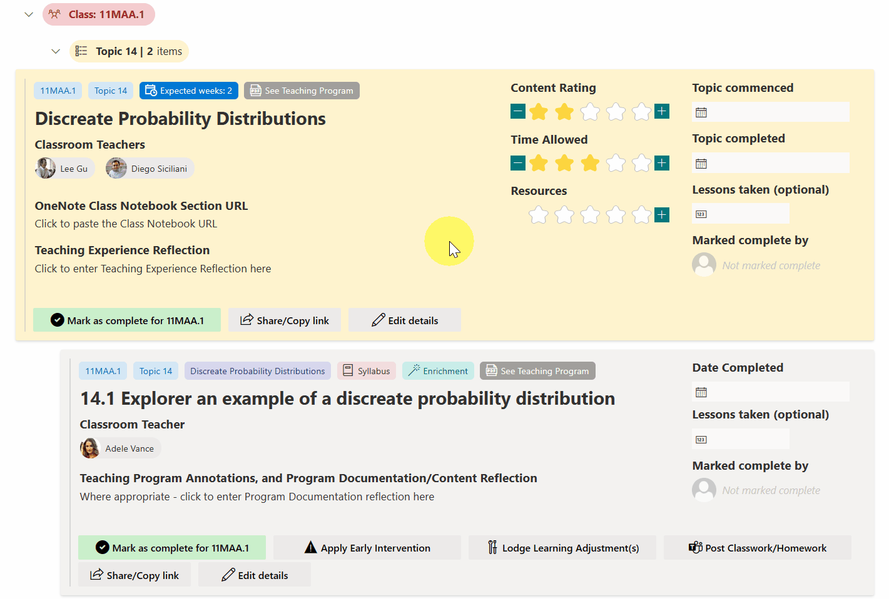
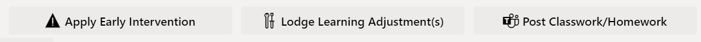

# Student & Class Learning Tracker

## Summary

This sample transforms your list into a learning tracker which enables teachers to
- Mark items that have been taught in class, as _Complete_
- Place a URL to the Class Notebook
- Perform teaching reflection
  - Rate the content/time allowed/resources provided by the faculty
  - Type in any optional teaching experience reflection
- Execute other flows which may have been built for the faculty
  - **Early Intervention** flow
  - **Lodge Learning Adjustment** flow (not functional yet)
  - **Post Classwork/Homework to Student Team** flow
- View in calendar mode, so that the actual length of a topic can be reassessed for the upcoming year

[📺 Recording made in May 2023 (whilst the Student & Class Learning Tracker was trialled)](https://youtu.be/MJj9jWLtQQU)

## View requirements
The view format expect the following fields. All **Number** fields should have zero decimal places.

Internal Name |Type | Choices | Allow Fill in Choice | Min/max values | Other notes
--------|---------|--------|---------|---------|---------
Title	| Single line of text	 | | 
CalendarYear | Choice | `2023`, `2024`, `2025` etc | Yes  |  | 
YearGroup | Choice	| `Year 7`, `Year 8`, `Year 9` etc | No |  | 
Class	| Choice | _Class names_ , e.g. `8MAT.N`, `9MAT.B`, `11MAA.1`, `11MAX.1`, `12MAA.1`, `12MAX.1`, `12MXX.1` etc | No | N/A
TopicNumber | Number	|| | `1` to `40`
TopicName | Single line of text | | 
TopicContentSequence | Number	| | | `0` to `100` ( `0` = Topic Content Header (yellow card), any other number = TopicContent (grey card)
ContentPointType | Choice	| `Syllabus`, `Teaching` | No | 
SeniorCourse | Choice | `Advanced`, `Extension 1`, `Extension 2` | No |  | Add `Standard 1` and `Standard 2` if needed
HPGE | Choice	| `Enrichment`, `Extension`, `Revision` | No | N/A
Content	| Single line of text	
AssignedTo	| Multi Person	
ClassNotebookURL | Multiple lines of text	
MarkedCompleteBy | Person or Group	
Reflection |	Multiple lines of text	
CommencementDate	| Date and Time	| | | | Time not required
CompletionDate | Date and Time	| | | | Time not required
ContentCompletedUpdateLog | Multiple lines of text	
ContentRating | Number	| | | `0` to `5` | 
TimeAllowedRating | Number	| | | `0` to `5` | 
ResourcesRating | Number	| | | `0` to `5` | 
ApproxLessons | Number	| | | `0` to `50` | 
WeeksExpected | Number| | | `0` to `50` | 

### Views to make it work
The following views are needed, with the JSON code applied to the following views:

View name | Type | Sorting | Filtering | Group | Other notes | JSON code to paste
--------|---------|--------|---------|---------|---------|---------
`Year 07`, `Year 08`, ... , `Year 12` etc | List | `TopicContentSequence`, asc | `YearGroup` equal to `Year 7` etc | `Class`, then `TopicNumber` | See the progress of every class, down to the program content progress | student-class-learning-tracker-overview.json
`Assigned to me` | List | `TopicContentSequence`, asc | `AssignedTo` equal to `[Me]` and `CalendarYear` geq `=YEAR([Today])` and `Completion Date` equal to _(blank)_ | `Class`, then `TopicNumber` | As above, but only shows classes assigned to Me | student-class-learning-tracker-overview.json
`Assigned to me (also show completed)` | List | `TopicContentSequence`, asc | `AssignedTo` equal to `[Me]` and `Calendar Year` geq `=YEAR([Today])`  | `Class`, then `Topic Number` | | student-class-learning-tracker-overview.json
`Cohort overview - Year 07`, `Cohort overview - Year 08` etc | List | `Class` asc | `YearGroup` equal to `Year 7` etc, and `Calendar Year` geq `=YEAR([Today])` and `TopicContentSequence` equal to `0` and `Completion Date` equal to _blank_ | Gives a cohort overview (shows yellow cards only) | | student-class-learning-tracker-overview.json
`Calendar - Year 07`, `Calendar - Year 08` etc | Calendar | | `YearGroup` equal to `Year 7` etc | | `CommencementDate` as the calendar start date, `CompletionDate` as the calendar completion date. Title auto-set by Power Automate import | student-class-learning-tracker-calendar.json

All grouping is initially collapsed.

### Ideas for other Power Automate flows to plug into this sample
There are several buttons which utilises an if-then Excel like formula to determine which Power Automate flow to execute.

You'll need to replace these buttons with your own flows. For simplicity, those flows aren't shared within this sample, but the name of the button should give you an idea of what's possible.

Button name | Flow ID | Intention
--------|---------|--------
Apply Early Intervention | `30b64ec0-4c65-4f9b-a772-35dcf89de082` | Create an early intervention entry, which has further functionality to send parents an email
Lodge Learning Adjustment | `f446013b-3291-40fa-89df-fda631b70940` | Lodge a learning adjustment (disability or gifted) that has been applied for student(s).
Post Classwork/Homework | `4f0c45b4-ed48-45e7-9a63-8ac3d981f823` | Posts classwork/homework to an existing team that contains students to remind of homework

## Sample

Solution|Author(s)
--------|---------
student-class-learning-tracker.json | [Hubert Lam](https://github.com/z3019494)
student-class-learning-tracker-calendar.json | [Hubert Lam](https://github.com/z3019494)

## Version history

Version|Date|Comments
-------|----|--------
1.0|14 July 2023|Initial release

## Disclaimer

**THIS CODE IS PROVIDED *AS IS* WITHOUT WARRANTY OF ANY KIND, EITHER EXPRESS OR IMPLIED, INCLUDING ANY IMPLIED WARRANTIES OF FITNESS FOR A PARTICULAR PURPOSE, MERCHANTABILITY, OR NON-INFRINGEMENT.**

---

## Additional notes

- A Flow needs to be used in order for the program items to be entered correctly.
- The Excel file(s) required, and the Flow sample will be uploaded shortly.

## Acknowledgements
The Student & Class Learning Tracker was inspired by multiple other samples found here in the PnP community, and the author greatly acknowledges their contributions.
- [Giuliano Del Luca's Video Library view](https://github.com/giuleon/ListViewFormattingVideoLibrary)
- [Andre Lage's Board Tags](https://github.com/pnp/list-formatting/tree/master/view-samples/board-tags)
- [Andre Lage's Reorder and Expand Board Items](https://github.com/pnp/List-Formatting/tree/master/view-samples/reorder-expand-board-items)
- [Chris Kent's Conditionally Launch Flow for Item](https://github.com/pnp/List-Formatting/tree/master/column-samples/generic-start-flow-conditionally)
- [Tetsuya Kawahara's Assign to Me column formatting](https://github.com/pnp/List-Formatting/tree/master/column-samples/person-assign-to-me)
- [Tetsuya Kawahara's Star Rating column formatting](https://github.com/pnp/List-Formatting/tree/master/column-samples/number-star-rating)
- [Michel Mendes' Group Header Status Icon and Color group formatting](https://github.com/pnp/list-formatting/tree/master/view-samples/group-header-status-icon-color)

