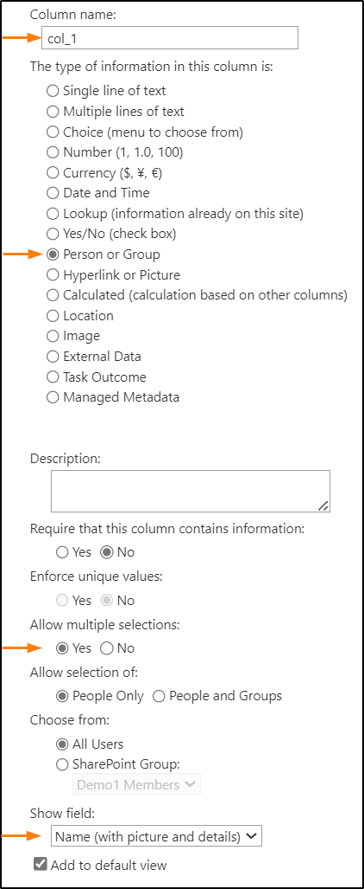

# Table

## Summary

This sample demonstrate how to turn list items into a custom table.

## View requirements
Required|Type|Internal Name
--------|----|-
No | Person or Group | ExecutiveManagement
No | Person or Group | Finance
No | Person or Group | HR
No | Person or Group | IT
No | Person or Group | Legal
No | Person or Group | Marketing
No | Person or Group | RnD

> [!NOTE]
> It is necessary to set `Show field` value to `Name (with picture and details)`.  
> Set `Allow multiple sections` to `Yes`.

## Sample

Solution|Author(s)
--------|-
table.json |[Watana](https://github.com/watana2)

## Version history
Version|Date|Comments
-------|----|-
1.0    |December 20, 2024 |Initial release

## Disclaimer
**THIS CODE IS PROVIDED *AS IS* WITHOUT WARRANTY OF ANY KIND, EITHER EXPRESS OR IMPLIED, INCLUDING ANY IMPLIED WARRANTIES OF FITNESS FOR A PARTICULAR PURPOSE, MERCHANTABILITY, OR NON-INFRINGEMENT.**

