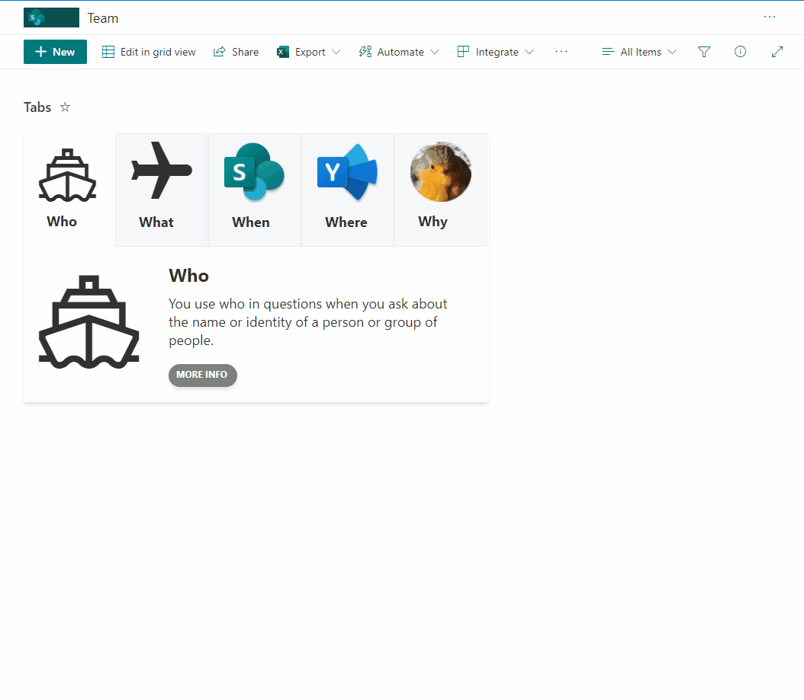

# tabs format 

## Summary
This sample format allow to create tabs with associated content. This sample help users to display content in SharePoint page content using a more interactive and user friendly approach. Sample allow to include the header of Tab, icon or url to image, content to display when tab selected and link redirection for more information.
Since is possible to create multiple tabs, using the view capabilties can filter each view to only display associated tab and then include in associated SharePoint page.

## View requirements
- The format expect the following fields:

Field |Type
--------|---------
Title | Single line of text 
TabHead1 | Single line of text  - Tab name
Tab1Desc | Multiple lines of text - Description of Tab content
Tab1Icon | Single line of text - Icon name or url to image
TabUrl1 | Single line of text  - url to "more info" button
TabHead2 | Single line of text 
Tab2Desc | Multiple lines of text
Tab2Icon | Single line of text 
TabUrl2 | Single line of text 
TabHead3 | Single line of text 
Tab3Desc | Multiple lines of text
Tab3Icon | Single line of text 
TabUrl3 | Single line of text 
TabHead4 | Single line of text 
Tab4Desc | Multiple lines of text
Tab4Icon | Single line of text 
TabUrl4 | Single line of text 
TabHead5 | Single line of text 
Tab5Desc | Multiple lines of text
Tab5Icon | Single line of text 
TabUrl5 | Single line of text 
Position | Number - Tab position selected

## Filter Tab to display content

Since is possible to create multiple tabs, using the view capabilties can filter each view to only display associated tab and then include in associated SharePoint page.

Access to View edit option and access to "**Filter**" area, check "**Show items only when the following is true:**" and select column and content to be filter to only display associated tabs.

## Sample

Solution|Author(s)
--------|---------
tabs-format.json | [André Lage](https://twitter.com/aaclage)

## Version history

Version|Date|Comments
-------|----|--------
1.0|February 17, 2022|Initial release

## Disclaimer
**THIS CODE IS PROVIDED *AS IS* WITHOUT WARRANTY OF ANY KIND, EITHER EXPRESS OR IMPLIED, INCLUDING ANY IMPLIED WARRANTIES OF FITNESS FOR A PARTICULAR PURPOSE, MERCHANTABILITY, OR NON-INFRINGEMENT.**

