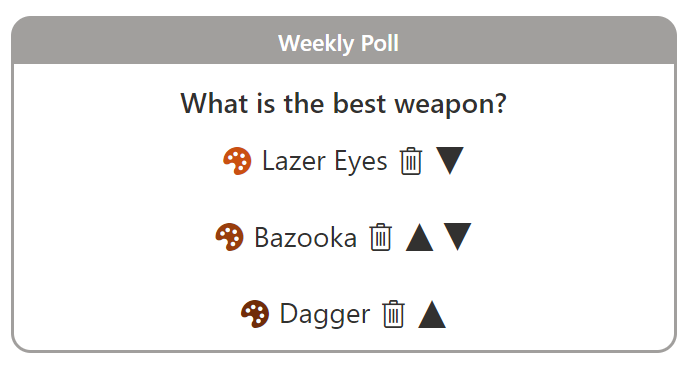
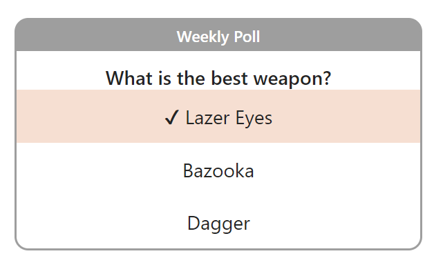

# Team Poll

## Summary
This sample combines a couple of lists and a few formats to demonstrate creating an application using view formatting. The end result is a configurable poll that end users can submit their choices too and view grouped results.

An optional Power Automate flow is also presented below to ensure that as Team Members are added to the Office 365 Group a response list item is configured automatically for them.

## View requirements

### Poll list

|Type|Internal Name|Required|
|---|---|:---:|
|Single line of text|Title|Yes|
|Single line of text|Question|Yes|
|Single line of text|Option1|No
|Single line of text|Option2|No
|Single line of text|Option3|No
|Single line of text|Color1|No
|Single line of text|Color2|No
|Single line of text|Color3|No
|Number|Iteration|Yes

### Poll Responses list

|Type|Internal Name|Required|
|---|---|:---:|
|Single line of text|Title|Yes|
|Person|User|No|
|Lookup|Poll|Yes|
|Additional Column from Poll Lookup|Poll_x003a__x0020_Option_x0020_1|No|
|Additional Column from Poll Lookup|Poll_x003a__x0020_Option_x0020_2|No|
|Additional Column from Poll Lookup|Poll_x003a__x0020_Option_x0020_3|No|
|Additional Column from Poll Lookup|Poll_x003a__x0020_Color_x0020_1|No|
|Additional Column from Poll Lookup|Poll_x003a__x0020_Color_x0020_2|No|
|Additional Column from Poll Lookup|Poll_x003a__x0020_Color_x0020_3|No|
|Additional Column from Poll Lookup|Poll_x003a__x0020_Iteration|No|
|Number|ResponseIteration|No|
|Single line of text|Selection|No|
|Single line of text|SelectionwithColor|No|

> Those ugly names are automatically created when we select the additional columns when configuring the Poll lookup column. Fun!

> [!NOTE]  
> When using `team-poll-results.json`, it is necessary to group by the `SelectionwithColor` column.

## Flow Prompt

"When a Horse is added or removed from an Office 365 Group, look up the user's profile, and then create a list item in SharePoint"

## Sample

Solution|Author(s)
--------|---------
team-poll-configuration.json | [Chris Kent](https://github.com/thechriskent) ([@thechriskent](https://twitter.com/thechriskent))
team-poll-response.json | [Chris Kent](https://github.com/thechriskent) ([@thechriskent](https://twitter.com/thechriskent))
team-poll-results.json | [Chris Kent](https://github.com/thechriskent) ([@thechriskent](https://twitter.com/thechriskent))

## Version history

Version|Date|Comments
-------|----|--------
1.0|August 3, 2023|Initial release

## Disclaimer
**THIS CODE IS PROVIDED *AS IS* WITHOUT WARRANTY OF ANY KIND, EITHER EXPRESS OR IMPLIED, INCLUDING ANY IMPLIED WARRANTIES OF FITNESS FOR A PARTICULAR PURPOSE, MERCHANTABILITY, OR NON-INFRINGEMENT.**

---

