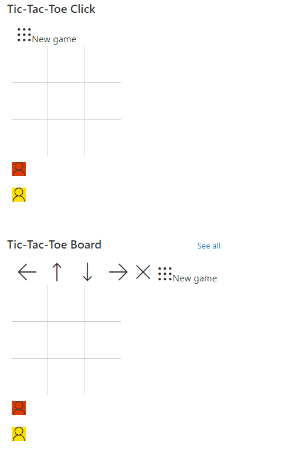

# Tic-tac-toe

## Summary

This sample demonstrates a version of tic-tac-toe using list formatting. By using the `setValue` action, the underlying list items are updated and the format is redrawn.

Two versions of the sample are included:
- **tic-tac-toe.json** allows users to click directly in the position and add the associated circle.
- **tic-tac-toe-arrows.json** provides a board where you can move position based on arrows.

## View requirements
- The format expect the following fields:

Field |Type
--------|---------
Title | Single line of text 
Count | Number  - default value 0
Yellow | Choice - check allow multiple selections and check "Allow 'Fill-in' choices" to yes
Red | Choice - check allow multiple selections and check "Allow 'Fill-in' choices" to yes

## Sample

Solution|Author(s)
--------|---------
tic-tac-toe.json | [André Lage](https://github.com/aaclage)
tic-tac-toe-arrows.json | [André Lage](https://github.com/aaclage)

## Version history

Version|Date|Comments
-------|----|--------
1.0|December 16, 2021|Initial release

## Disclaimer

**THIS CODE IS PROVIDED *AS IS* WITHOUT WARRANTY OF ANY KIND, EITHER EXPRESS OR IMPLIED, INCLUDING ANY IMPLIED WARRANTIES OF FITNESS FOR A PARTICULAR PURPOSE, MERCHANTABILITY, OR NON-INFRINGEMENT.**

---

## Additional notes
None

