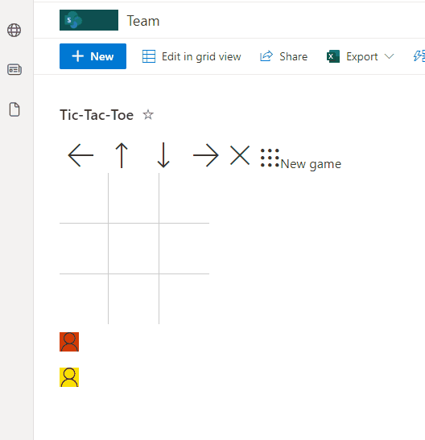

# tic tac toe format

## Summary

This sample recreate the tic tac toe game using SharePoint List formatting and new feature "**setValue**" to allow Power users provide additional flexibility to their custom solutions.

## View requirements
- The format expect the following fields:

Field |Type
--------|---------
Title | Single line of text 
Count | Number  - default value 0
Yellow |Choice - check allow multiple selections and check "Allow 'Fill-in' choices" to yes
Red | Choice - check allow multiple selections and check "Allow 'Fill-in' choices" to yes

## Sample

Solution|Author(s)
--------|---------
tictactoe-format.json | André Lage (Microsoft)

## Version history

Version|Date|Comments
-------|----|--------
1.0|December 16, 2021|Initial release

## Disclaimer

**THIS CODE IS PROVIDED *AS IS* WITHOUT WARRANTY OF ANY KIND, EITHER EXPRESS OR IMPLIED, INCLUDING ANY IMPLIED WARRANTIES OF FITNESS FOR A PARTICULAR PURPOSE, MERCHANTABILITY, OR NON-INFRINGEMENT.**

---

## Additional notes
None

