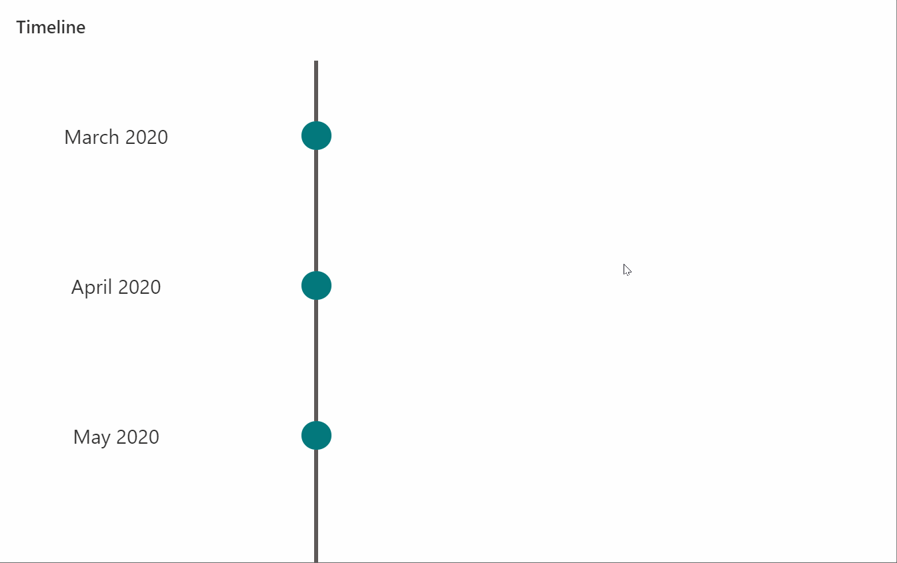
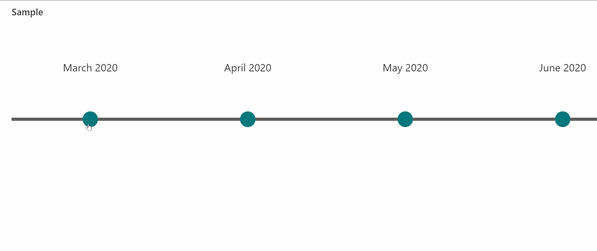

# Timeline Format

## Summary
This sample formats your SharePoint list view to look like a timeline.

vartical-timeline-format.json

horizontal-timeline-format.json

## View requirements

Column Name   |Type
--------------|--------------
Title         | Single Line Text
Description   | Multi Line Text

## Sample

Solution                        |Author(s)
--------------------------------|---------------------------
vartical-timeline-format.json   |[Tetsuya Kawahara](https://twitter.com/techan_k)
horizontal-timeline-format.json |[Tetsuya Kawahara](https://twitter.com/techan_k)

## Version history

Version |Date              |Comments
--------|------------------|--------------------------------
1.0     |October 17, 2020  |Initial release
2.0     |November 17, 2020 |Added horizontal-timeline-format

## Disclaimer
**THIS CODE IS PROVIDED *AS IS* WITHOUT WARRANTY OF ANY KIND, EITHER EXPRESS OR IMPLIED, INCLUDING ANY IMPLIED WARRANTIES OF FITNESS FOR A PARTICULAR PURPOSE, MERCHANTABILITY, OR NON-INFRINGEMENT.**

