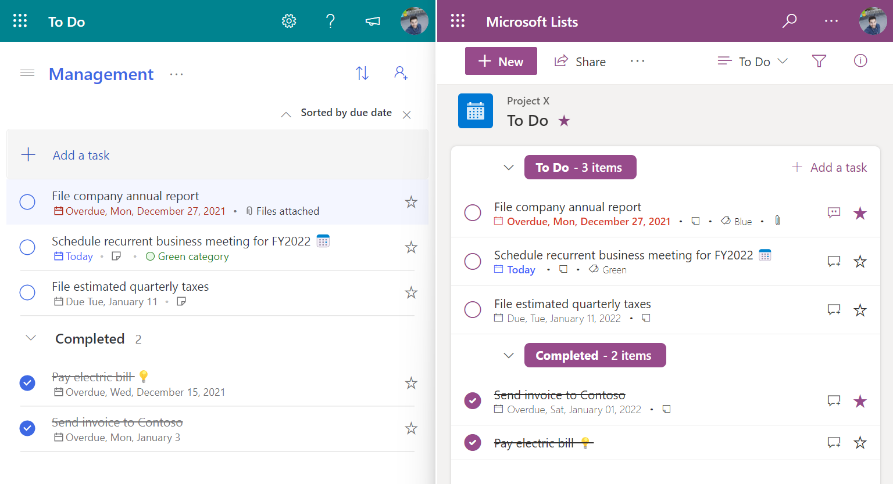

# To-do List

## Summary
This sample formats your SharePoint list view to look like Microsoft To Do.

## View requirements

Column Name   |Type
--------------|--------------
Title         | Single Line Text
Description   | Multi Line Text
Category   | Choice
Due date   | Date and time
Important   | Yes/No, with default value set to No
Status   | Yes/No, with default value set to No
Date   | Calculated, as a single line of text using the formula: =CONCATENATE(TEXT(WEEKDAY([Due date]),"ddd"),", ",TEXT([Due date],"mmmm dd, yyyy"))

## More info and details

This sample and all the options and decisions made to implement it, is explained in detail in a serie of articles:    

1️⃣ [List Definition](https://lists.handsontek.net/create-list-using-sharepoint-microsoft-lists-view-formatting-part-1/)  
2️⃣ [List view customization](https://lists.handsontek.net/create-list-using-sharepoint-microsoft-lists-view-formatting-part-2/)  
3️⃣ [To Do list template](https://lists.handsontek.net/create-list-using-sharepoint-microsoft-lists-view-formatting-part-3/)   

A resumed version of the articles is also available in video format

🎥 [Creating a To Do list for Microsoft Lists and SharePoint using View Formatting](https://www.youtube.com/watch?v=Ic5ZdBso3iI)   

## Sample

Solution|Author(s)
--------|---------
to-do.json | [João Ferreira](https://github.com/joaoferreira)

## Version history

Version |Date              |Comments
--------|------------------|--------------------------------
1.0     |March 4, 2022  |Initial release

## Disclaimer
**THIS CODE IS PROVIDED *AS IS* WITHOUT WARRANTY OF ANY KIND, EITHER EXPRESS OR IMPLIED, INCLUDING ANY IMPLIED WARRANTIES OF FITNESS FOR A PARTICULAR PURPOSE, MERCHANTABILITY, OR NON-INFRINGEMENT.**

