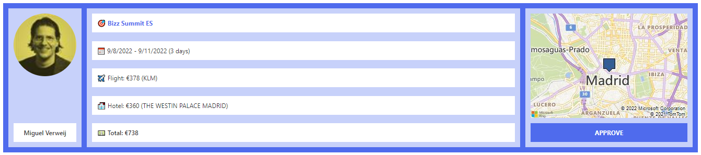

# Travel Requests

## Summary
This sample formats the SharePoint list template Travel requests.

The approve button will set the value of the Approved column to Yes (true).

## View requirements

### SharePoint List

|Type                |Internal Name     |Required|
|--------------------|------------------|:------:|
|Single line of text |Title             |Yes     |
|Person or Group     |Requester         |No      |
|Location            |Destination       |No      |
|Date and Time       |TravelStartDate   |No      |
|Date and Time       |TravelEndDate     |No      |
|Calculated          |TravelDuration    |No      |
|Choice              |Airline           |No      |
|Number              |EstimatedAirfare  |No      |
|Location            |Hotel             |No      |
|Number              |EstimatedHotelCost|No      |
|Yes/No              |Approved          |No      |

The items above are not required, but highly recommended. Furthermore, You could filter the view on the Approved column (Approved? is equal to No) to create an action list. You can then copy that view and adjust the filtering to yest and name the view approved, to only indicate approved items.

### Bing maps key

The view shows a static map image of the Destination column. You need to enter a Bing Map key to make it work. You can create an account at the [Bing maps Dev Center](https://www.bingmapsportal.com/). Once registered, you can create a key. Copy that key and put it in the json file where indicated.

## Sample

Solution|Author(s)
--------|---------
travel-request.json | [Miguel Verweij](https://github.com/miguelverweij) ([@MiguelVerweij](https://twitter.com/MiguelVerweij))

## Version history

Version |Date              |Comments
--------|------------------|--------
1.0     |August 20, 2022   |Initial release

## Disclaimer
**THIS CODE IS PROVIDED *AS IS* WITHOUT WARRANTY OF ANY KIND, EITHER EXPRESS OR IMPLIED, INCLUDING ANY IMPLIED WARRANTIES OF FITNESS FOR A PARTICULAR PURPOSE, MERCHANTABILITY, OR NON-INFRINGEMENT.**

