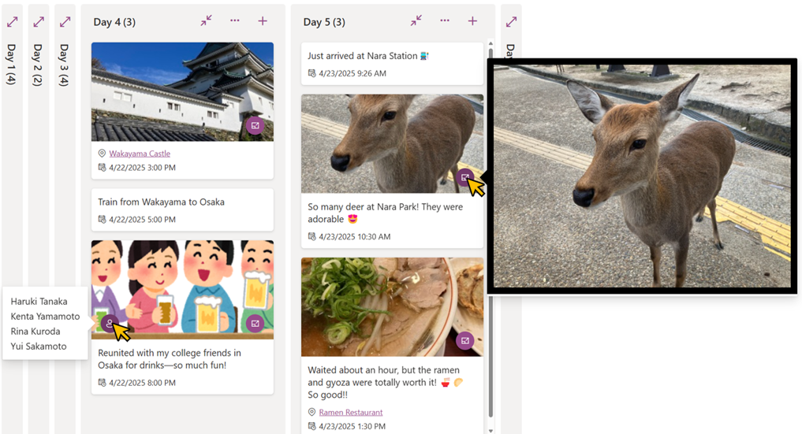

# Travel Tweets Board

## Summary

This sample demonstrates using the Board view to display travel tweets in a timeline format. Each tweet supports one photo and one map link.

## View requirements

|Type                          |Internal Name|Required|
|------------------------------|-------------|:------:|
|Single line of text           |Title        |Yes     |
|Date and Time (Including Time)|DateTime     |Yes     |
|Hyperlink                     |Map          |        |
|Image                         |Image        |        |
|Multi-Select Choice           |PeopleInImage|        |

- The board view must be used.
- In addition to the above columns, a choice column is required to organize the board view.

## Sample

Solution|Author(s)
--------|---------
travel-tweets-board.json | [Tetsuya Kawahara](https://github.com/tecchan1107) ([@techan_k](https://twitter.com/techan_k))

## Version history

Version |Date           |Comments
--------|---------------|--------------------------------
1.0     |April 27, 2025 |Initial release

## Disclaimer
**THIS CODE IS PROVIDED *AS IS* WITHOUT WARRANTY OF ANY KIND, EITHER EXPRESS OR IMPLIED, INCLUDING ANY IMPLIED WARRANTIES OF FITNESS FOR A PARTICULAR PURPOSE, MERCHANTABILITY, OR NON-INFRINGEMENT.**

## Additional notes

- This sample is intended for use in a [Microsoft Lists MSA](https://www.microsoft.com/microsoft-365/microsoft-lists-preview).

