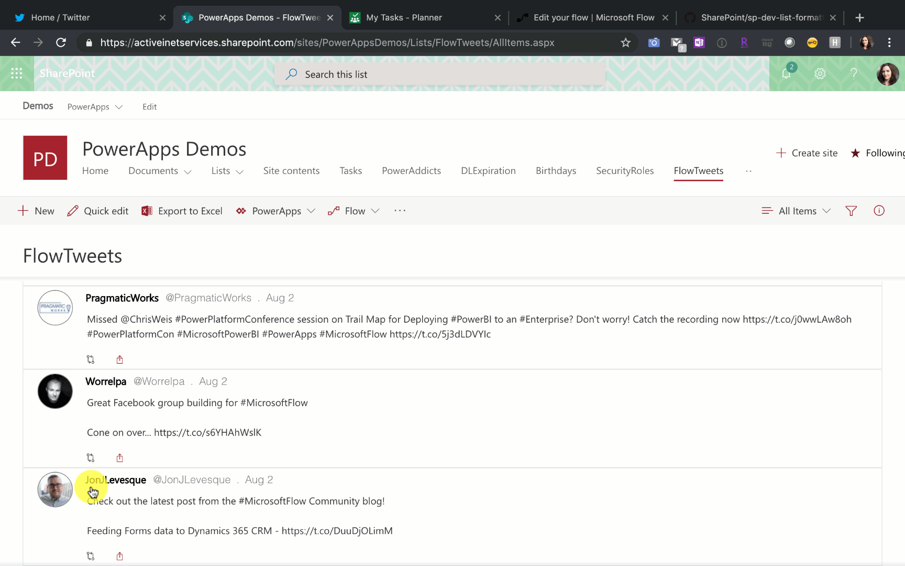

# Twitter Timeline

## Summary
This sample formats your SharePoint list view to look like Twitter. If you are using the Microsoft Flow Templates to track tweets in a SharePoint list, this is a great way to format your list so that it looks more like Twitter. For more info on Flow Templates that take Tweets and add them to a SharePoint list check out this template: https://us.flow.microsoft.com/en-us/galleries/public/templates/e78571e5c70e4806a18eeacba5a897c8/save-tweets-that-include-a-specific-hashtag-to-a-sharepoint-list/

This sample features the following:
- Responsive layout through flexbox
- Shows the number of retweets
- Share icon which takes you to the Tweet in Twitter so you can like, retweet, etc
- The Person's name is a hyperlink to their Profile
- Pulls in Twitter Profile Pictures

Screen Capture of working Links

## View requirements

|Type|Internal Name|Required|
|---|---|:---:|
|Single line of text|Title|Yes|
|Single line of text|TweetBy|Yes|
|Single line of text|TweetByFullName|Yes|
|Date Time|TweetDate|Yes|
|Calculated Column|TweetFormattedDate|Yes|
|Hyperlink|TwitterProfilePic|Yes|
|Hyperlink|ProfileLink|Yes|
|Hyperlink|LinkToTweet|Yes|
|Multi Line of Text|FullTweet|Yes|
|Number|NumbRetweets|Yes|

You need the `TweetFormattedDate` Calculated Column so that it only shows the current month name spelled out and date (not the year or time). The formula for this calculated column is below:

`=TEXT(TweetDate,"mmm d")`

## Sample

Solution|Author(s)
--------|---------
twitter-timeline.json | [April Dunnam](https://github.com/aprildunnam) ([@aprildunnam](https://twitter.com/aprildunnam))

## Version history

Version|Date|Comments
-------|----|--------
1.0|August 2, 2019 |Initial release

## Disclaimer
**THIS CODE IS PROVIDED *AS IS* WITHOUT WARRANTY OF ANY KIND, EITHER EXPRESS OR IMPLIED, INCLUDING ANY IMPLIED WARRANTIES OF FITNESS FOR A PARTICULAR PURPOSE, MERCHANTABILITY, OR NON-INFRINGEMENT.**

---

