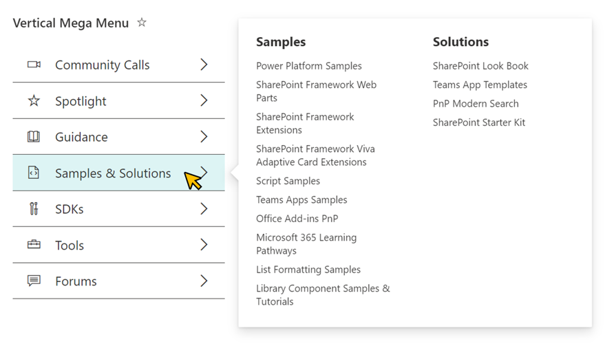

# Vertical Mega Menu

## Summary

This sample demonstrates the use of multi lines of text column value and the `split` operator to display a vertical mega menu.



## View requirements

|Type                |Internal Name|Required|
|--------------------|-------------|:------:|
|Single line of text |Title        |Yes     |
|Single line of text |Icon         |Yes     |
|Multi lines of text |Menu         |Yes     |

- Set the icon name of [Fluent UI Icons](https://developer.microsoft.com/fluentui#/styles/web/icons) in the `Icon` column.
- Set the `Menu` column to a value like the following.
```
@@@[Header]
>[Link Text]|[URL]
>[Link Text]|[URL]
>[Link Text]|[URL]
@@@[Header]
>[Link Text]|[URL]
>[Link Text]|[URL]
>[Link Text]|[URL]
```

> Note: Do not set `>` and `|`, which are used as delimiters, to [Header] and [Link Text].

- The following is an example of the value of the `Menu` column.
```
@@@Samples
>Power Platform Samples|https://pnp.github.io/powerplatform-samples/
>SharePoint Framework Web Parts|https://pnp.github.io/sp-dev-fx-webparts/
>SharePoint Framework Extensions‍|https://pnp.github.io/sp-dev-fx-extensions/
>SharePoint Framework Viva Adaptive Card Extensions|https://github.com/pnp/sp-dev-fx-aces/
>Script Samples|https://pnp.github.io/script-samples/
>Teams Apps Samples|https://pnp.github.io/teams-dev-samples/
>Office Add-ins PnP|https://github.com/OfficeDev/Office-Add-in-samples/
>Microsoft 365 Learning Pathways|https://github.com/pnp/custom-learning-office-365/
>List Formatting Samples|https://pnp.github.io/List-Formatting/
>Library Component Samples & Tutorials|https://github.com/pnp/sp-dev-fx-library-components/
@@@Solutions
>SharePoint Look Book|https://lookbook.microsoft.com/
>Teams App Templates|https://learn.microsoft.com/microsoftteams/platform/samples/app-templates/
>PnP Modern Search|https://microsoft-search.github.io/pnp-modern-search/
>SharePoint Starter Kit‍|https://github.com/pnp/sp-starter-kit/
```

## Sample

Solution|Author(s)
--------|---------
vertical-mega-menu.json | [Tetsuya Kawahara](https://github.com/tecchan1107) ([@techan_k](https://twitter.com/techan_k))

## Version history

Version |Date              |Comments
--------|------------------|--------------------------------
1.0     |December 13, 2022 |Initial release

## Disclaimer
**THIS CODE IS PROVIDED *AS IS* WITHOUT WARRANTY OF ANY KIND, EITHER EXPRESS OR IMPLIED, INCLUDING ANY IMPLIED WARRANTIES OF FITNESS FOR A PARTICULAR PURPOSE, MERCHANTABILITY, OR NON-INFRINGEMENT.**

## Additional notes
- [Fluent UI Icons](https://developer.microsoft.com/fluentui#/styles/web/icons)

