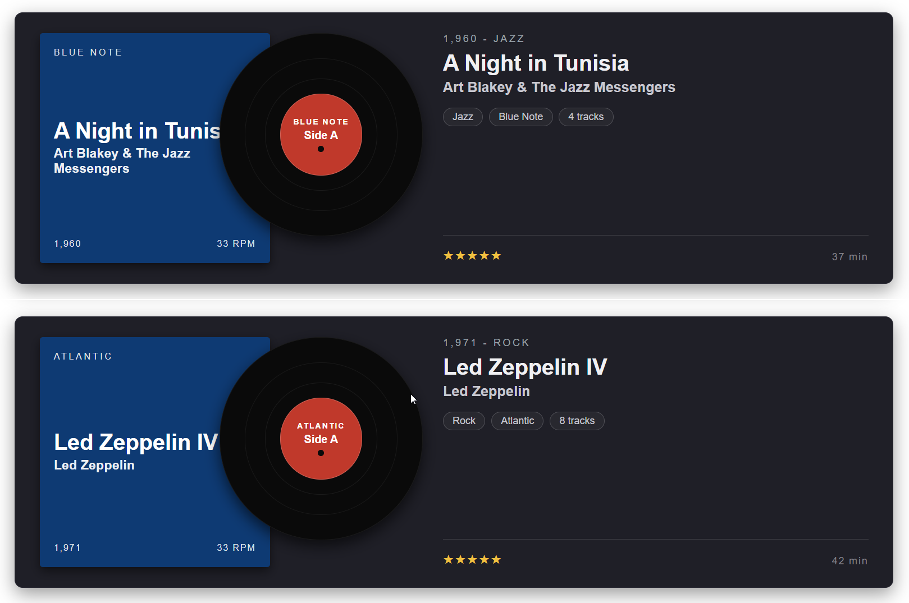

# Vinyl Record / Album Sleeve

## Summary

This SharePoint JSON view formatting sample transforms list items into vinyl record album cards. Each item renders as an album sleeve on the left with a vinyl record peeking out to the right, followed by a metadata column with year, genre, label, track count, rating, and duration. It's designed for music libraries, podcast catalogues, or any "collection" style list.

## View requirements

### Recommended SharePoint List Columns

| Column Name      | Internal Name     | Type                | Description                                                  |
| ---------------- | ----------------- | ------------------- | ------------------------------------------------------------ |
| Title            | Title             | Single line of text | Album title (e.g. A Night in Tunisia)                        |
| Artist           | Artist            | Single line of text | Artist or band name                                          |
| Label            | Label             | Single line of text | Record label (e.g. Blue Note, Atlantic, Sub Pop)             |
| Year             | Year              | Number              | Release year (e.g. 1960)                                     |
| Genre            | Genre             | Choice              | Music genre (Jazz, Rock, Pop, Indie, Folk, Hip-Hop, etc.)    |
| Side             | Side              | Choice              | Side label shown on the record (Side A, Side B)              |
| Tracks           | Tracks            | Number              | Number of tracks on the album                                |
| Duration Minutes | DurationMinutes   | Number              | Total duration in minutes (e.g. 37)                          |
| Rating           | Rating            | Single line of text | Star rating as text (e.g. `★★★★★`)                          |

A PowerShell script has been provided in the [assets](./assets/Create%20List.ps1) folder to provision the list for you.

**Note:** This script uses [PnP PowerShell](https://pnp.github.io/powershell/) and requires an environment ready for PnP PowerShell.

## Sample

Solution|Author
--------|---------
vinyl-record.json | [Sudeep Ghatak](https://github.com/sudeepghatak) ([LinkedIn](https://www.linkedin.com/in/sudeepghatak/))

## Version history

Version|Date|Comments
-------|----|--------
1.0|May 11, 2026|Initial release

## Disclaimer

**THIS CODE IS PROVIDED *AS IS* WITHOUT WARRANTY OF ANY KIND, EITHER EXPRESS OR IMPLIED, INCLUDING ANY IMPLIED WARRANTIES OF FITNESS FOR A PARTICULAR PURPOSE, MERCHANTABILITY, OR NON-INFRINGEMENT.**

---

## Additional notes

- The vinyl record is rendered entirely with concentric div elements (no images) — outer disc, middle disc, inner disc, and a coloured centre label. The black "spindle hole" in the middle is also a styled div.
- The record overlaps the sleeve by `margin-left: -50px` so it looks like it's sliding out.
- The **Side** column lets you flip between *Side A* and *Side B* labelling on the centre disc without touching the formatter.
- **Rating** is stored as plain text so users can paste ★ / ☆ glyphs directly (e.g. `★★★★☆`).
- Year and other numeric fields are wrapped in `toString()` inside expressions to avoid the SharePoint view formatter's strict number+string concatenation rule.

