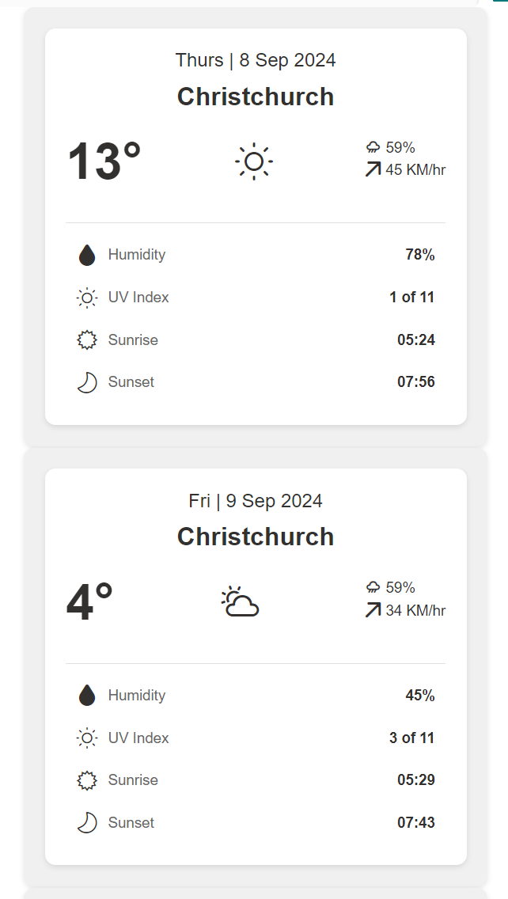

# Weather forecast

## Summary

This sample transforms list items into cards formatted with weather forecast layouts. To ensure the view functions correctly, make sure all specified columns are included. The icons are referenced from [Fluent UI Icons](https://developer.microsoft.com/en-us/fluentui#/styles/web/icons).

## View requirements

Column Name               | Type
--------------------------|----------------------------------------
Title                     | Single line of text
Location                  | Single line of text
Temperature               | Number
Weather                   | Choice (Sunny,Cloudy,Rainy,Snowy)
Wind                      | Single line of text
Humidity                  | Number
UVIndex                   | Single line of text
Sunrise                   | Single line of text
Sunset                    | Single line of text
Rain                      | Number

## Sample

Solution|Author
--------|---------
weather-forecast.json | [Sudeep Ghatak](https://github.com/sudeepghatak) ([LinkedIn](https://www.linkedin.com/in/sudeepghatak/))

## Version history

Version|Date|Comments
-------|----|--------
1.0|August 09, 2024|Initial release

## Disclaimer
**THIS CODE IS PROVIDED *AS IS* WITHOUT WARRANTY OF ANY KIND, EITHER EXPRESS OR IMPLIED, INCLUDING ANY IMPLIED WARRANTIES OF FITNESS FOR A PARTICULAR PURPOSE, MERCHANTABILITY, OR NON-INFRINGEMENT.**

---

## Additional notes

None

