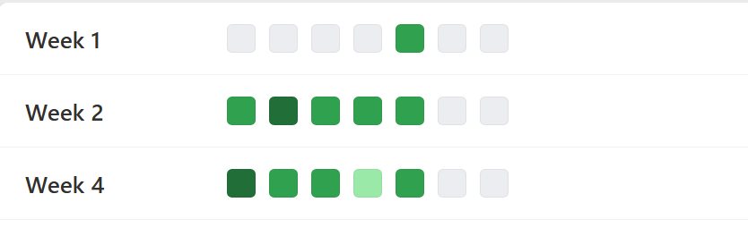

# Weekly Heatmap

This sample uses **SharePoint List Formatting** to display weekly data as a **heatmap calendar view**.  
Each row represents a week, and daily values are visualized with conditional background colors, making it easy to spot trends and high/low activity days.

## List Requirements

Create a list with the following columns:

| Column Name     | Type               |
|-----------------|--------------------|
| **Title**       | Single line of text|
| **WeekStartDate** | Date and Time (Date only) |
| **Monday**      | Number             |
| **Tuesday**     | Number             |
| **Wednesday**   | Number             |
| **Thursday**    | Number             |
| **Friday**      | Number             |
| **Saturday**    | Number             |
| **Sunday**      | Number             |
| **Team**        | Choice (e.g., Development, QA, Design, etc.) |

## Sample Data

| Title   | WeekStartDate        | Monday | Tuesday | Wednesday | Thursday | Friday | Saturday | Sunday | Team        |
|---------|----------------------|--------|---------|-----------|----------|--------|----------|--------|-------------|
| Week 1  | 2025-08-01T04:00:00Z | 0      | 0       | 0         | 0        | 10     | 0        | 0      | Development |
| Week 2  | 2025-08-04T04:00:00Z | 10     | 20      | 8         | 9        | 7      | 0        | 0      | Development |
| Week 4  | 2025-08-11T04:00:00Z | 12     | 11      | 8         | 3        | 10     | 0        | 0      | Development |

## How it Works

- Each day (Monday–Sunday) is displayed in a horizontal weekly row.
- Cell background colors are based on the **numeric values** (higher values = darker shade).
- The `WeekStartDate` column ensures proper ordering of weekly records.
- The `Team` column can be used to filter heatmaps by department.

## Screenshot

> 📌 Replace with a real screenshot from your list once formatting is applied.

## JSON Code

See the full JSON here: [weekly-heatmap.json](weekly-heatmap.json)

## Additional Notes

- You can adjust the **color scale thresholds** in the JSON to match your data distribution.
- Supports both **light** and **dark** SharePoint themes.
- Works best in **List view** with `WeekStartDate` sorted ascending.

---

## Sample

Solution|Author
--------|---------
Weekly HeatMap.json | [Sai Bandaru](https://github.com/saiiiiiii) ([LinkedIn](https://www.linkedin.com/in/sai-bandaru-97a946153/))

## Version history

Version|Date|Comments
-------|----|--------
1.0|August 19, 2025|Initial release

## Disclaimer
**THIS CODE IS PROVIDED *AS IS* WITHOUT WARRANTY OF ANY KIND, EITHER EXPRESS OR IMPLIED, INCLUDING ANY IMPLIED WARRANTIES OF FITNESS FOR A PARTICULAR PURPOSE, MERCHANTABILITY, OR NON-INFRINGEMENT.**

---
