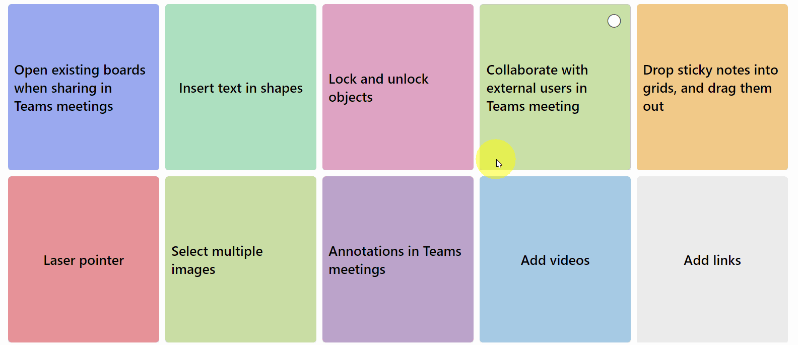

# Whiteboard sticky notes

## Summary

This sample creates a whiteboard-styled sticky notes that displays information. The sticky notes have two sides, so when clicked they show another piece of information.

## View requirements

|Type|Internal Name|Required|
|---|---|:---:|
|Single line of text|Title|Yes|
|Multi lines of text|About|Yes|
|Single line of text|Color|Yes|
|Hyperlink|Link|No|

- You need to use the Gallery View.
- `Color` should be set to the HTML color code or color name. Example of set value, `#9CAAF1`, `pink`.

## Sample

Solution|Author(s)
--------|---------
whiteboard-sticky-notes.json | [Anand Ragav](https://github.com/anandragav) ([@anandVragav](https://twitter.com/anandVragav))

## Version history

Version|Date|Comments
-------|----|--------
1.0|November 04, 2022|Initial release

## Disclaimer

**THIS CODE IS PROVIDED *AS IS* WITHOUT WARRANTY OF ANY KIND, EITHER EXPRESS OR IMPLIED, INCLUDING ANY IMPLIED WARRANTIES OF FITNESS FOR A PARTICULAR PURPOSE, MERCHANTABILITY, OR NON-INFRINGEMENT.**

---

## Additional notes

- None

